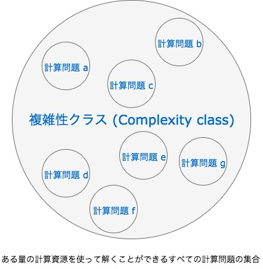
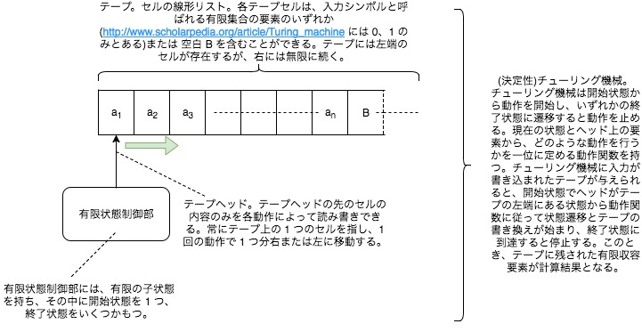
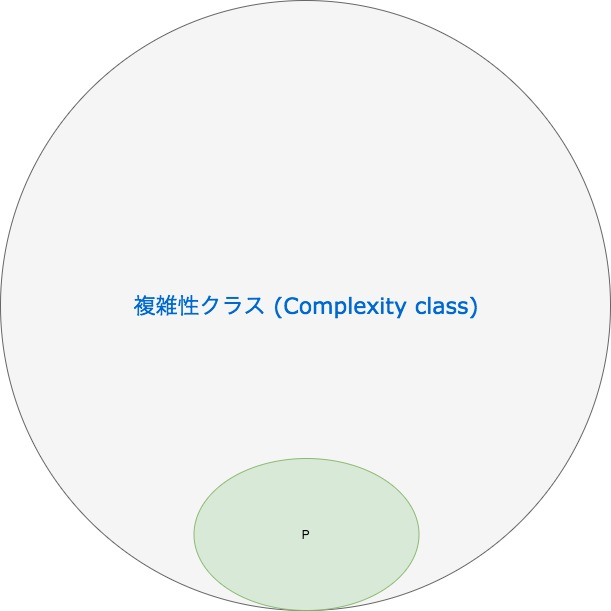
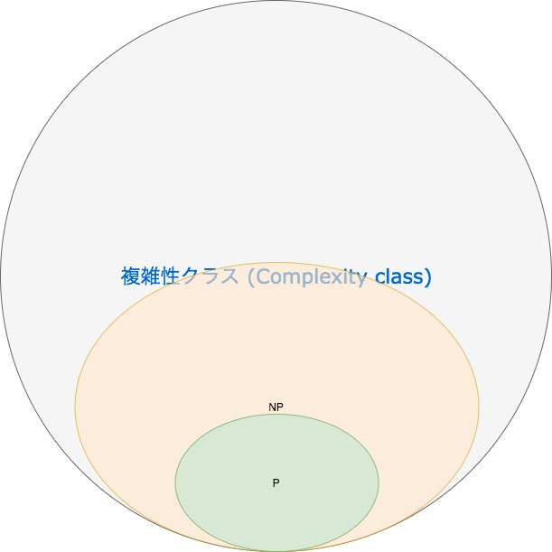
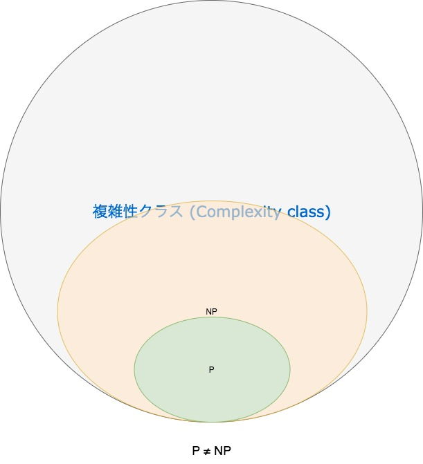
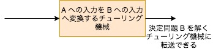
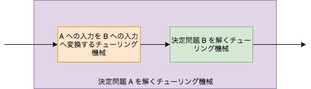
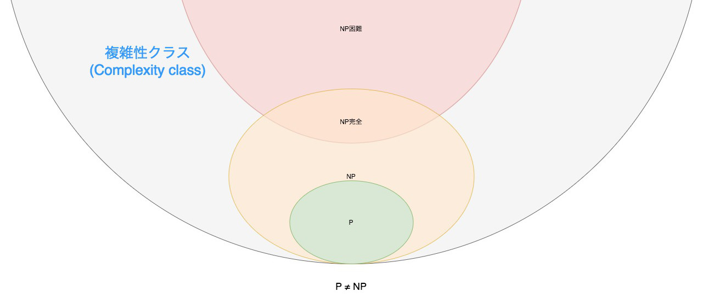

# 16.7 アルゴリズムと計算量理論

この項では、アルゴリズムと実装、またその性能を表すのに多様される O 記法、そしてアルゴリズムの複雑性クラスの分類について平易に説明します。<br>
尚、本項で説明されているコード例は単純化されており、実際の利用にはより強い型制約を設けるなどが必要です。また、本項で説明されているコード例は、[こちらのドキュメント](https://falgon.github.io/ThePoliteWayLearnToCpp17/namespace_t_p_l_c_x_x17_1_1chap16__7__1.html)と照らし合わせる事ができます。もしよければご覧ください。

## 16.7.1 アルゴリズムと O 記法

O 記法はある特定のアルゴリズムの計算量を示すことのできる記法です。計算量とは、主に時間計算量と空間計算量を内包した意味合いです。時間計算量があるアルゴリズムにどれだけの計算を行うか、空間計算量があるアルゴリズムが計算にどれだけの記憶領域を利用するかを示します。
例えば、$$ 1 $$ から $$ n $$($$ n $$ は整数とする)までの整数の総和($$ \sum_{ k = 1 }^{ n } k = 1 + 2 + 3 + ... n $$)を求める時、どのように計算を行うと良いでしょうか？
愚直な実装は次のようになるでしょう。
```cpp
//! TPLCXX17 namespace
namespace TPLCXX17 {
//! chapter 16.7.1 namespace
namespace chap16_7_1 {
//! version 1 namespace
namespace v1 {
/**
 * @brief 1 から @a n までの総和を求めます
 * @param n unsigned int の整数値
 * @return 1 から @a n までの総和を返します
 * @code
 * void sum_sample()
 * {
 *      [[maybe_unused]] int r = TPLCXX17::chap16_7_1::v1::sum(10);
 * }
 * @endcode
*/
unsigned int sum(unsigned int n)
{
    int k = 0;
    for (unsigned int i = 1; i <= n; ++i) k += i;
    return k;
}

} // namespace v1
} // namespace chap16_7_1
} // namespace TPLCXX17
```
この実装だと、加算を $$ n - 1 $$ 回行いますから、時間計算量を$$ O(N) $$、空間計算量を $$ O(1) $$ というように書きます。これは、ビッグオー記法(O 記法)と言います。O は order で、ここでは次数を意味するものです。
$$ O(N - 1) $$ ではないのかと思われるかもしれませんが、ビッグオー記法では一番規模の大きな計算だけを残し、さらに係数を $$ 1 $$ とするようにして記述する慣習があります。これは、分かりやすさの他に、相対誤差が殆ど無いことに起因します。
ところで、先ほどの有限級数は高校数学の次の公式で求めることができますね。<br>
$$ (n + 1) \dfrac{n}{2} $$ 
少し話は逸れてしまいますが、念のため説明しておきますと、まず $$ S = 1 + 2 + 3 + ... + n $$ というのは当然ながら $$ S = 1 + 2 + 3 + ... + (n - 1) + n $$ です。
総和の式を逆順にして、$$ S = n + (n - 1) + (n - 2) + ... + 2 + 1 $$ とします。次に、$$ S $$ を二倍します。すると $$ 2S = (n + (n - 1) + (n - 2) + ... + 2 + 1) + (1 + 2 + ... + (n - 2) + (n - 1) + n) $$ ですね。置き換えると、$$ 2S = (1 + n) + (2 + n - 1) + ... + (n - 1 + 2) + (n + 1) $$ です。この式はさらに置き換えることが出来、$$ 2S = (n + 1) + (n + 1) + ... + (n + 1) + (n + 1) $$ であり $$ 2S = \underbrace{(n + 1) + (n + 1) + ... + (n + 1) + (n + 1)}_{n} $$ なので、$$ 2S = n(n + 1) $$ となります。つまり、$$ S $$ は $$ n (n + 1) / 2 $$ となりますね。  
こちらの実装は次のようになるでしょう。
```cpp
namespace TPLCXX17 {
namespace chap16_7_1 {
//! version 2 namespace
namespace v2 {
/**
 * @brief 1 から @a n までの総和を総和の公式を利用して求めます
 * @param n unsigned int 型の整数値
 * @return 1 から @a n までの総和を返します
 * @code
 * void sum_sample()
 * {
 *      [[maybe_unused]] int r = TPLCXX17::chap16_7_1::v2::sum(10);
 * }
 * @endcode
*/
unsigned int sum(unsigned int n)
{
    return n * (n + 1) / 2;
}

} // namespace v2
} // namespace chap16_7_1
} // namespace TPLCXX17
```
この実装ではご覧の通り、加算、積算、除算で計算し終えます。ですから時間計算量は、$$ O(3) $$ ... ではなく前述した通り $$ O(1) $$ と書きます。空間計算量も $$ O(1) $$ ですね。<br>
もう一つ例を取り上げてみましょう。例えば $$ n $$ 以下の素数を全て見つけ出す時、どのように計算を行うと良いでしょうか？
愚直な実装は次のようになるでしょう($$ n $$ は下記コード`n`に対応しています)。
```cpp
#include <cmath>
namespace TPLCXX17 {
namespace chap16_7_1 {
namespace v1 {
/**
 * @brief @a n より小さい素数値を総当たりによって @a oiter に全て出力します
 * @param n unsigned int 型の整数値
 * @param oiter 出力イテレータ
 * @return 出力イテレータを返します
 * @code
 * #include <vector>
 * void primes_sample()
 * {
 *      std::vector<unsigned int> res;
 *      TPLCXX17::chap16_7_1::v1::primes(42, std::back_inserter(res));
 * }
 * @endcode
*/
template <class OutputIterator>
OutputIterator primes(unsigned int n, OutputIterator oiter)
{
    if (n > 2) *oiter++ = 2;
    for (unsigned int i = 3; i <= n; i += 2) { // (1)
        bool k = true;
        for (unsigned int j = 3, sqrti = std::sqrt(i); j <= sqrti; j += 2) { // (2)
            if (!(i % j)) { // (3)
                k = false;
                break;
            }
        }
        if (k) *oiter++ = i;
    }
    return oiter;
}

} // namespace v1
} // namespace chap16_7_1
} // namespace TPLCXX17
```
この実装は $$ 1 $$ から`n`まで順々に素数判定を行うアルゴリズムを少し最適化したものです。
$$ 2 $$ 以外の素数は奇数ですから、`(1)`の通り奇数のみを調査対象としています。また、任意の値 $$ a $$ が合成数である場合は、必ず $$ \sqrt{a} $$ より小さい素因数を持つはずです。念のため説明しておきましょう。$$ N $$ が合成数とします。よって $$ N = ab $$(但し $$ 1 \lt a \leq b \land a, b \in \mathbb{Z} $$) となります。つまり、$$ N = ab \geq a^{2} $$ ですから $$ \sqrt{N} \geq a $$ となるのです。これを証明 (a) としておきましょう。さて、という事は、$$ a $$ が素数であるかは $$ \sqrt{a} $$ 以下の素数で mod 演算を行えば良い事となります。
さらに、`(1)`で奇数のみを対象としていますから、$$ 3 $$ から開始して、以降奇数のみで mod 演算を行えば良い事となります。これらは`(2)`に対応しています。`(3)`で mod 演算を行い、割り切れた時点で、`k`に`false`をセットしてループを抜けます。
ところで、このアルゴリズムはどのような計算量となるでしょうか。
$$ a $$ が素数かを判定するのに最大 $$ \sqrt{a} $$ 回くらい(前述したように、ビッグオー記法の慣習からある程度の端数は切り落とされる)で、それを`n`回くらい繰り返しますから、このアルゴリズムの時間計算量は $$ O(n\sqrt{n}) $$、空間計算量は $$ O(1) $$ と表されます。<br>
次に少し賢い方法でこの問題に取り組んでみましょう。以下のコードは、エラトステネスの篩と言われるアルゴリズムを実装したものです。
```cpp
#include <cmath>
#include <vector>
namespace TPLCXX17 {
namespace chap16_7_1 {
namespace v2 {
/**
 * @brief @a n より小さい素数値をエラトステネスの篩によって @a oiter に全て出力します
 * @param n unsigned int 型の整数値
 * @param oiter 出力イテレータ
 * @return 出力イテレータを返します
 * @code
 * #include <vector>
 * void primes_sample()
 * {
 *      std::vector<unsigned int> res;
 *      TPLCXX17::chap16_7_1::v2::primes(42, std::back_inserter(res));
 * }
 * @endcode
*/
template <class OutputIterator>
OutputIterator primes(unsigned int n, OutputIterator oiter)
{
    std::vector<bool> prime(n, 1);
    prime[0].flip();

    for (unsigned int i = 0, end = std::sqrt(n), k = 0; i < end; ++i) {
        if (prime[i]) {
            k = i + 1;
            for (unsigned int j = k * 2 - 1; j < n; j += k) prime[j] = 0;
        }
    }

    for (unsigned int i = 0; i < n; ++i) {
        if (prime[i]) *oiter++ = i + 1;
    }
    return oiter;
}

} // namespace v2
} // namespace chap16_7_1
} // namespace TPLCXX17
```
このアルゴリズムは、先ほどの証明 (a) を併用して $$ \sqrt{n} $$ 以下の素数の倍数(自身を除く)を全て篩い落とすことで、素数を得るアルゴリズムです。例えば、$$ n = 30 $$、$$ A $$ を残っている素数集合とした時、篩い落としの様子は次の通りです。
1. $$ A = \{2, 3 ... , 30\} $$
2. 2 の倍数を篩落とし、$$ A=\{2,3,5,7,9,11,13,15,17,19,21,23,25,27,29\} $$
3. 3 の倍数を篩落とし、$$ A=\{2,3,5,7,11,13,17,19,23,25,29\} $$
4. 5 の倍数を篩落とし、$$ A=\{2,3,5,7,11,13,17,19,23,29\} $$
5. 7 は $$ \sqrt{30} $$ よりも大きいため終了

上記コードでは、`prime`にビット単位でその値が素数かどうかのフラグを管理させています。この処理によって、$$ \sqrt{n} $$ 以下の素数の個数分だけこの篩落としが行われます。つまり計算量は $$ \sum_{p \lt \sqrt{n}} \dfrac{n}{p} = \dfrac{n}{2} + \dfrac{n}{3} + \dfrac{n}{5} + ... $$ (但し、和は $$ \sqrt{n} $$ 以下の素数全体に対して取る) であると言えます。
$$ \sqrt{n} $$ までの素数の逆数和は $$ \log\log \sqrt{n}=\log\log n+\log \dfrac{1}{2} $$ ですので、時間計算量は $$ O(n \log \log n) $$ となります。
また、空間計算量はそれが素数であるか判定するビットフラグが必要なので、$$ O(N) $$ となります。
なお、篩い落としの方法の改善などで、$$ n $$ 以下の素数を見つけるといったアルゴリズムは時間計算量を $$ O(N) $$ よりもさらに下げることができます。それに関しての解説は本項の範囲を超えますので特に触れませんが、興味のある方は調べてみたり、[実装](https://github.com/falgon/SrookCppLibraries/tree/develop/srook/math/primes/progression)を見てみるのも良いかもしれません。
<br>
さて、愚直な方法とエラトステネスの篩で時間計算量を比較してみると、$$ n $$ が十分に大きい場合にエラトステネスの篩の方が圧倒的に少なくなる事が分かります。しかしながら、空間計算量は愚直なアルゴリズムの方が少なくなる事も分かります。このようにビックオー記法を用いると、各アルゴリズムの比較や考察において、どれぐらいの計算時間、記憶領域を必要とするのかを、簡潔に理解する事ができるのです。

最後に、よく利用される計算量オーダーを以下にまとめます。

### $$ O(K^{n}) $$
指数オーダーです。これは、最悪の計算量です。どのような工夫を凝らしてもこの計算量である場合はその問題解決は不可能です。
よって、より少ない計算量から近似値を得るなどしてある程度結果に妥協をしなければなりません。
このような計算量となる有名な問題には、[巡回セールスマン問題](https://ja.wikipedia.org/wiki/%E5%B7%A1%E5%9B%9E%E3%82%BB%E3%83%BC%E3%83%AB%E3%82%B9%E3%83%9E%E3%83%B3%E5%95%8F%E9%A1%8C)などがよく挙げられます。巡回セールスマン問題とは、あるセールスマンがいくつかの都市を1回ずつ訪問して、スタート地点の都市に戻ってくるとき、総移動距離が最も短くなるように都市の巡回順序を決めるという問題です。この問題は、都市数の増加に対して時間計算量が急速に増加するため、一定以上の都市数となると厳密な解を求める事は現実的でなくなります。

### $$ O(N^{2}) $$
二乗オーダーです。例えば、選択ソートの時間計算量は、このオーダーに匹敵します。選択ソートとは、配列された要素から最小値または最大値を探索して、配列最初または最後の要素と入れ替える事でソートを行うアルゴリズムです。これは、比較的遅い部類のアルゴリズムです。
```cpp
#include <algorithm>
#include <functional>
namespace TPLCXX17 {
namespace chap16_7_1 {
namespace v1 {
/**
 * @brief 範囲を選択ソートします
 * @param first 範囲の最初のイテレータ
 * @param last 範囲の最後 + 1 のイテレータ
 * @param comp bool 値へ文脈変換可能な比較関数オブジェクト
 * @return なし
 * @code
 * #include <numeric>
 * #include <random>
 * 
 * void selection_sort_sample()
 * {
 *      std::vector<int> v(10);
 *      std::iota(std::begin(v), std::end(v), mt);
 *      std::random_device seed;
 *      std::mt19937 mt(seed());
 *      std::shuffle(std::begin(v), std::end(v), mt);
 * 
 *      TPLCXX17::chap16_7_1::v1::selection_sort(std::begin(v), std::end(v)); // less than
 *      TPLCXX17::chap16_7_1::v1::selection_sort(std::begin(v), std::end(v), std::greater<>()); // greater than
 * }
 * @endcode
*/
template <class ForwardIterator, class Compare>
void selection_sort(ForwardIterator first, ForwardIterator last, Compare comp)
{
    for (ForwardIterator iter = first; iter != last; ++iter) {
        std::iter_swap(iter, std::min_element(iter, last, comp));
    }
}
#ifndef DOXYGEN_SHOULD_SKIP_THIS
template <class ForwardIterator>
void selection_sort(ForwardIterator first, ForwardIterator last)
{
    selection_sort(first, last, std::less<>());
}
#endif
} // namespace v1
} // namespace chap16_7_1
} // namespace TPLCXX17
```
選択ソートは、1 つのデータの位置を確定するために、$$ (n - 1) $$ 回の比較(上記コードでは、`std::min_element`がその役割を担っています)が必要です。
1 つのデータが確定していくごとに、次の比較対象のデータが 1 つずつ減っていきます。これは、次のように表す事ができます。<br>
$$ (n - 1) + (n - 2) + \cdots + (n - (n - 2)) + (n - (n - 1)) = (n - 1) + (n - 2) + \cdots + 2 + 1 $$
<br>
これは要するに $$ 1 $$ から $$ n - 1 $$ の総和を求めていることと同義です。つまり、本項の初めで述べた総和の公式を利用して、<br>
$$ \displaystyle \sum_{i=1}^{n-1} i = \frac{n(n-1)}{2} = \frac{n^2-n}{2} $$
と表す事ができます。また、値の交換(上記コードでは、`std::iter_swap`がその役割を担っています)は各ループごとに最大 1 回です。つまり全体としては $$ n - 1 $$ 回の時間計算量です。
これらの和から O 記法の慣用を適用すると計算量は $$ O(n^{2}) $$ である事が分かります。
尚、選択ソートは非安定ソートです。安定ソートとは、ソートアルゴリズムのうち同等なデータのソート前の順序と、ソート後の順序が保持されるソートアルゴリズムを言います。選択ソートはそうではありません。<br>
また、バブルソートもこのオーダーによく分類されるアルゴリズムです。バブルソートとは、隣り合う要素の大小比較を行い、その結果に応じて並び替えるソートアルゴリズムです。
```cpp
#include <algorithm>
#include <functional>
namespace TPLCXX17 {
namespace chap16_7_1 {
namespace v1 {
#ifndef DOXYGEN_SHOULD_SKIP_THIS
template <class ForwardIterator, class Compare>
void iter_swap_if(ForwardIterator x, ForwardIterator y, Compare comp)
{
    if (comp(*x, *y)) std::iter_swap(x, y);
}
#endif

/**
 * @brief 範囲をバブルソートします
 * @param first 範囲の最初のイテレータ
 * @param last 範囲の最後 + 1 のイテレータ
 * @param comp bool 値へ文脈変換可能な比較関数オブジェクト
 * @return なし
 * @code
 * #include <numeric>
 * #include <random>
 * 
 * void bubble_sort_sample()
 * {
 *      std::vector<int> v(10);
 *      std::iota(std::begin(v), std::end(v), mt);
 *      std::random_device seed;
 *      std::mt19937 mt(seed());
 *      std::shuffle(std::begin(v), std::end(v), mt);
 * 
 *      TPLCXX17::chap16_7_1::v1::bubble_sort(std::begin(v), std::end(v)); // less than
 *      TPLCXX17::chap16_7_1::v1::bubble_sort(std::begin(v), std::end(v), std::greater<>()); // greater than
 * }
 * @endcode
*/
template <class ForwardIterator, class Compare>
void bubble_sort(ForwardIterator first, ForwardIterator last, Compare comp)
{
    for (ForwardIterator i = first; i != last; ++i) {
        for (ForwardIterator j = first; j < i; ++j) {
            iter_swap_if(i, j, comp);
        }
    }
}
#ifndef DOXYGEN_SHOULD_SKIP_THIS
template <class ForwardIterator>
void bubble_sort(ForwardIterator first, ForwardIterator last)
{
    bubble_sort(first, last, std::less<>());
}
#endif

} // namespace v1
} // namespace chap16_7_1
} // namespace TPLCXX17
```
要素の一番目と二番目を比較して順番が逆であれば入れ替え(上記コードでこの比較処理と入れ替えは、`iter_swap_if`が担っています。)、次に二番目と三番目に対して同様にして比較、入れ替えを行い、次に三番目と... というように最後まで実行すると、最後の値が最小または最大となり、その値の位置が確定します。そして再度確定した値以外で、全ての値の位置が確定するまで同様の処理を繰り返します。至極単純ですが、これがバブルソートというアルゴリズムです。<br>
尚前述した通り、バブルソートはよくこの計算量オーダー(時間計算量)のアルゴリズムとして分類されますが、前述した選択ソートよりも低速です。比較回数はバブルソート、選択ソート共に同じですが、交換回数は選択ソートの方が少ないためです。また、選択ソートは非安定ソートであることに対してバブルソートは安定ソートです。<br>
他にも、挿入ソートと言われるソートアルゴリズムもこのオーダーに分類されます。挿入ソートは、ソート済みの要素列に対して新たな要素を適切な位置へ挿入していく事でソートを行うソートアルゴリズムです。
```cpp
#include <algorithm>
#include <functional>
#include <iterator>
namespace TPLCXX17 {
namespace chap16_7_1 {
namespace v1 {

/**
 * @class search_insert
 * @brief 線形探索による探索と挿入を行う関数オブジェクト
*/
struct search_insert {
    /**
     * @param first 範囲の最初の BidirectionalIterator コンセプトを満たすイテレータ
     * @param iter イテレート中における現在のイテレータ
     * @param comp bool 値へ文脈変換可能な比較関数オブジェクト
     * @return なし
    */
    template <class BidirectionalIterator, class Compare>
    void operator()(BidirectionalIterator first, BidirectionalIterator iter, Compare comp)
    {
        typedef typename std::iterator_traits<BidirectionalIterator>::value_type value_type;
        const value_type x = *iter;
        do {
            *iter = *std::next(iter, -1);
            std::advance(iter, -1);
        } while (!comp(iter, first) && !comp(*std::next(iter, -1), x));
        *iter = x;
    }
};

/**
 * @brief 範囲を挿入ソートします
 * @param first 範囲の最初のイテレータ
 * @param last 範囲の最後 + 1 のイテレータ
 * @param comp bool 値へ文脈変換可能な比較関数オブジェクト
 * @param search_inserter 挿入位置の検索を行い、挿入を実行する関数オブジェクト
 * @return なし
 * @code
 * #include <numeric>
 * #include <random>
 * 
 * void insertion_sort_sample()
 * {
 *      std::vector<int> v(10);
 *      std::iota(std::begin(v), std::end(v), mt);
 *      std::random_device seed;
 *      std::mt19937 mt(seed());
 *      std::shuffle(std::begin(v), std::end(v), mt);
 * 
 *      TPLCXX17::chap16_7_1::v1::insertion_sort(std::begin(v), std::end(v)); // less than
 *      TPLCXX17::chap16_7_1::v1::insertion_sort(std::begin(v), std::end(v), std::greater<>()); // greater than
 * }
 * @endcode
*/
template <class BidirectionalIterator, class Compare, class SearchInserter>
void insertion_sort(BidirectionalIterator first, BidirectionalIterator last, Compare comp, SearchInserter search_inserter)
{
    for (BidirectionalIterator i = std::next(first, 1); i != last; ++i) {
        if (!comp(*std::next(i, -1), *i)) { // (1)
            search_inserter(first, i, comp);
        }
   }
}
#ifndef DOXYGEN_SHOULD_SKIP_THIS
template <class BidirectionalIterator, class Compare>
void insertion_sort(BidirectionalIterator first, BidirectionalIterator last, Compare comp)
{
    insertion_sort(first, last, comp, search_insert());
}

template <class BidirectionalIterator>
insertion_sort(BidirectionalIterator first, BidirectionalIterator last)
{
    insertion_sort(first, last, std::less<>(), search_insert());
}
#endif

} // namespace v1
} // namespace chap16_7_1
} // namespace TPLCXX17
```
アルゴリズムの流れを次に示します。$$ a_{0}, a_{1}, a_{2}, \cdots, a_{5} = 3, 1, 4, 1, 5, 9 $$ という数列に対して昇順で挿入ソートを行います。

1. $$ a_{0} $$ をソートします。しかし $$ a_{0} $$ よりも前の値はないのでこれをソート済みとします。$$ a_{0} $$ はソートされました。
2. $$ a_{0} $$ から $$ a_{1} $$ をソートします。$$ a_{0} $$ はソート済みのため、それに対して挿入します。このとき、$$ a_{1} $$ は 1 ですから、$$ a_{0} $$ にこれを挿入します。それによって $$ a_{1} $$ に元々の $$ a_{0} $$ の値すなわち $$ 3 $$ がずれこみ、またそれに応じて全ての値が順にずれこみ、数列は $$ 1, 3, 4, 1, 5, 9 $$ になります。$$ a_{0} $$ から $$ a_{1} $$ はソートされました。
3. $$ a_{0} $$ から $$ a_{2} $$ をソートします。$$ a_{0} $$ から $$ a_{1} $$ はソート済みのため、それに対して挿入します。このとき、$$ a_{2} $$ は $$ 4 $$ ですから、ソート済みのどの値よりも大きいです。これは移動する必要がありません。$$ a_{0} $$ から $$ a_{2} $$ はソートされました。
4. $$ a_{0} $$ から $$ a_{3} $$ をソートします。$$ a_{0} $$ から $$ a_{2} $$ はソート済みのため、それに対して挿入します。このとき、$$ a_{3} $$ は $$ 1 $$ ですから、$$ a_{1} $$ にこれを挿入します(後述しますが、挿入位置が $$ a_{0} $$ とならない点が、このソートアルゴリズムの特徴でもあります)。それによって、2. と同様にして全ての値が順にずれ込み、数列は $$ 1, 1, 3, 4, 5, 9 $$ になります。$$ a_{0} $$ から $$ a_{3} $$ はソートされました。
5. $$ a_{0} $$ から $$ a_{4} $$ をソートします。$$ a_{0} $$ から $$ a_{3} $$ はソート済みのため、それに対して挿入します。このとき、$$ a_{4} $$ は $$ 5 $$ ですから、ソート済みのどの値よりも大きいです。これは移動する必要がありません。$$ a_{0} $$ から $$ a_{4} $$ はソートされました。
6. $$ a_{0} $$ から $$ a_{5} $$ をソートします。$$ a_{0} $$ から $$ a_{4} $$ はソート済みのため、それに対して挿入します。このとき、$$ a_{5} $$ は $$ 9 $$ ですから、ソート済みのどの値よりも大きいです。これは移動する必要がありません。$$ a_{0} $$ から $$ a_{5} $$ はソートされました。
7. 末尾に到達したため、ソートが完了しました。

このようにして選択ソートは行われます。処理内容にもある通り、たまたまソート済みであった場合には一切処理をせず次のステップに進む事ができます。上記コードではコメント`(1)`の判定がそれに対応します。また、このソートは安定ソートです。しかしながら、このソートの一連の流れにある挿入位置の決定処理(4. のような処理)において適切にその位置を決定しなければ、安定ソートでなくなってしまいます。<br>
上記コードでは、この挿入位置の決定に、線形探索を利用しており、コード中`search_insert`関数オブジェクトがそれに値します。この場合の挿入ソートの時間計算量は、$$ O(n^{2}) $$ となります。<br>
しかしながら、この検索部分には少し改善の余地が残されています。検索を行う範囲は、上記処理の通り、すでに挿入ソートの過程内でソート済みです。ソート済みの範囲に対しては、二分探索が有効なのです。二分探索については下記 $$ O(logN) $$ で説明します。

### $$ O(N logN) $$
念のためこの対数について説明しておくと、これは $$ N $$ を何回 $$ 2 $$ で割れば $$ 1 $$ になるかという意味です。例えば $$ N = 10^{12} $$($$1$$兆) としても約40回程度割れば $$ 1 $$ になります。このように、$$logN$$ の部分は殆ど増えないため、少し遅い $$ O(N) $$ 程度の時間計算量であると言えます。<br>さて、マージソートといわれるソートはこの時間計算量オーダーとなります。マージソートとは、すでにソート済みである複数個の列を 1 列にマージする際に、小さいもの(大きいもの)から順に新しい列に並べる事でソートします。手順としては、

1. データ列を分割する。
2. 分割されたデータ列内に含まれるデータが 1 つである場合それを返す。そうでなければ再帰的に 1 から 3 を適用する
3. 二つのソートされたデータ列(1 つのデータを含む)を小さいもの(大きいもの)から順に新しい列に並べるようにしてマージする

というように行います。
```cpp
#include <algorithm>
namespace TPLCXX17 {
namespace chap16_7_1 {
namespace v1 {
/**
 * @brief 範囲をマージソートします
 * @param first 範囲の最初のイテレータ
 * @param last 範囲の最後 + 1 のイテレータ
 * @param comp bool 値へ文脈変換可能な比較関数オブジェクト
 * @return なし
 * @code
 * #include <numeric>
 * #include <random>
 * 
 * void merge_sort_sample()
 * {
 *      std::vector<int> v(10);
 *      std::iota(std::begin(v), std::end(v), mt);
 *      std::random_device seed;
 *      std::mt19937 mt(seed());
 *      std::shuffle(std::begin(v), std::end(v), mt);
 * 
 *      TPLCXX17::chap16_7_1::v1::merge_sort(std::begin(v), std::end(v)); // less than
 *      TPLCXX17::chap16_7_1::v1::merge_sort(std::begin(v), std::end(v), std::greater<>()); // greater than
 * }
 * @endcode
*/
template <class RandomAccessIterator, class Compare>
void merge_sort(RandomAccessIterator first, RandomAccessIterator last, Compare comp)
{
    if (last - first > 1) {
        RandomAccessIterator middle = first + (last - first) / 2;
        merge_sort(first, middle, comp);
        merge_sort(middle, last, comp);
        std::inplace_merge(first, middle, last, comp);
    }
}
#ifndef DOXYGEN_SHOULD_SKIP_THIS
template <class RandomAccessIterator>
void merge_sort(RandomAccessIterator first, RandomAccessIterator last)
{
    merge_sort(first, last, std::less<>());
}
#endif
} // namespace v1
} // namespace chap16_7_1
} // namespace TPLCXX17
```
再帰によってデータ列を細分化して、マージソートの実際のマージ部分を`std::inplace_merge`に任せています。その名の通り、この関数は追加の作業記憶領域を必要としないため、この実装の空間計算量は $$ 0 $$ です。しかし、$$ O(n) $$ の空間計算量を必要とする実装も一般的に見られます。また、データ列に対するそれぞれのマージ操作は並列化が容易である特徴があります。また、安定なソートを実装できます。

また、クイックソートと言われる比較的高速なソートも、最良時間計算量及び平均計算量がこのオーダーです。クイックソートは、1つ適当な値(これをピボットと言います)を選択し、ピボットより小さい値を前方または後方、大きい値を前方または後方に移動し、二分割されたそれぞれのデータをそれぞれにソートします。
```cpp
#include <algorithm>
#include <functional>
namespace TPLCXX17 {
namespace chap16_7_1 {
namespace v1 {
/**
 * @brief 範囲の先頭をピボットとしてクイックソートを行います
 * @param first 範囲の最初のイテレータ
 * @param last 範囲の最後 + 1 のイテレータ
 * @param comp bool 値へ文脈変換可能な比較関数オブジェクト
 * @return なし
 * @code
 * #include <numeric>
 * #include <random>
 * 
 * void quick_sort_sample()
 * {
 *      std::vector<int> v(10);
 *      std::iota(std::begin(v), std::end(v), mt);
 *      std::random_device seed;
 *      std::mt19937 mt(seed());
 *      std::shuffle(std::begin(v), std::end(v), mt);
 * 
 *      TPLCXX17::chap16_7_1::v1::quick_sort(std::begin(v), std::end(v)); // less than
 *      TPLCXX17::chap16_7_1::v1::quick_sort(std::begin(v), std::end(v), std::greater<>()); // greater than
 * }
 * @endcode
*/
template <class BidirectionalIterator, class Compare>
void quick_sort(BidirectionalIterator first, BidirectionalIterator last, Compare comp)
{
    if (first == last) return;
    
    BidirectionalIterator l = first, r = std::next(last, -1);
    while (comp(l, r)) {
        for (; comp(*l, *first) && comp(l, r); ++l);
        for (; comp(*first, *r); --r);
        std::iter_swap(l, r);
    }
    std::iter_swap(first, l);
    quick_sort(first, l, comp);
    quick_sort(++l, last, comp);
}
#ifndef DOXYGEN_SHOULD_SKIP_THIS
template <class BidirectionalIterator>
void quick_sort(BidirectionalIterator first, BidirectionalIterator last)
{
    quick_sort(first, last, std::less<>());
}
#endif

} // namespace v1

#ifndef DOXYGEN_SHOULD_SKIP_THIS
namespace v2 {

// std::partition による実装
template <class BidirectionalIterator, class Compare>
void quick_sort(BidirectionalIterator first, BidirectionalIterator last, Compare comp)
{
    if (first == last) return;

    // std::partition() の時間計算量は O(n) です。
    BidirectionalIterator split = std::partition(std::next(first, 1), std::bind(comp, std::placeholders::_1, *first)); 
    std::iter_swap(first, std::next(split, -1));
    quick_sort(first, std::next(split, -1), comp);
    quick_sort(split, last, comp);
}
template <class BidirectionalIterator>
void quick_sort(BidirectionalIterator first, BidirectionalIterator last)
{
    quick_sort(first, last, std::less<>());
}

} //namespace v2
#endif
} // namespace chap16_7_1
} // namespace TPLCXX17
```
クイックソートは、ランダムなデータに対しては有効的ですが、すでにソート済みであったり、並び順が全く逆だったとき(例えば昇順に並び替えようとするデータ列が降順であった場合)、時間計算量が $$ O(n ^ {2}) $$ になってしまいます。クイックソートの高速さは初めのピボット選択が大きな鍵を握っている特性があるため、ピボットの選択方法を工夫する必要があります。上記の実装では、無条件でデータ列の一番先頭をピボットとしており、ピボットの選択方法としてはあまりにも愚直でよろしくありません。ピボットの選択方法には、乱数から選択する、データ列の中間を選択する、データ列から最初、中間、最後の要素を取り出してその中央値を選択するといった方法があります。特に最後のものは median-of-three と言われます。下記コードは、それを利用したクイックソートの実装です。
```cpp
namespace TPLCXX17 {
namespace chap16_7_1 {
namespace v2 {
/**
 * @brief median-of-three を得ます
 * @param x @a operator< によって比較可能な値
 * @param y @a operator< によって比較可能な値
 * @param z @a operator< によって比較可能な値
 * @return median-of-three を返します
 * @code
 * void med3_sample()
 * {
 *      [[maybe_unused]] auto r = TPLCXX17::chap16_7_1::v2::med3(4, 2, 3); // 3
 * }
 * @endcode
 */
template <class T>
const T& med3(const T& x, const T& y, const T& z) // median-of-three を得る
{
    return std::max(std::min(x, y), std::min(std::max(x, y), z)); 
}

/**
 * @brief median-of-three によってピボットを選択し、クイックソートを行います
 * @param first 範囲の最初のイテレータ
 * @param last 範囲の最後 + 1 のイテレータ
 * @param comp bool 値へ文脈変換可能な比較関数オブジェクト
 * @return なし
 * @code
 * #include <numeric>
 * #include <random>
 * 
 * void quick_sort_sample()
 * {
 *      std::vector<int> v(10);
 *      std::iota(std::begin(v), std::end(v), mt);
 *      std::random_device seed;
 *      std::mt19937 mt(seed());
 *      std::shuffle(std::begin(v), std::end(v), mt);
 * 
 *      TPLCXX17::chap16_7_1::v2::quick_sort(std::begin(v), std::end(v)); // less than
 *      TPLCXX17::chap16_7_1::v2::quick_sort(std::begin(v), std::end(v), std::greater<>()); // greater than
 * }
 * @endcode
 */
template <class BidirectionalIterator, class Compare>
void quick_sort(BidirectionalIterator first, BidirectionalIterator last, Compare comp)
{
    if (first == last) return;
    
    typedef typename std::iterator_traits<BidirectionalIterator>::value_type value_type;
    BidirectionalIterator miter = std::next(first, std::distance(first, last) / 2);
    const value_type pivot = med3(*first, *miter, *std::next(last, -1));
    BidirectionalIterator upper = std::partition(first, last, std::bind(comp, std::placeholders::_1, pivot));
    BidirectionalIterator lower = std::partition(upper, last, std::bind(std::not_fn(comp), pivot, std::placeholders::_1));

    quick_sort(first, upper, comp);
    quick_sort(lower, last, comp);
}

// ... v1::quick_sort と同じ comp なしのバージョンのオーバーロード(略)

} // namespace v2
} // namespace chap16_7_1
} // namespace TPLCXX17
```
median-of-three によって万事解決のように思えますが、これでも尚最悪の時間計算量は $$ O(N^{2}) $$ のままです。どのような場合でなりうるかというと、多くの等しい値の並ぶデータ列に対するソートです。例えば昇順ソートをするとき、その入力データの全てが同等の値であったとします。ソートの過程で、左側のパーティションが空のまま、そして右側のパーティションから 1 つずつ要素が削除されていきます。これが $$ O(N^{2}) $$ の時間計算量を要する事となってしまうのです。この問題は、[Dutch national flag problem(直訳すると、オランダ国旗問題)](https://en.wikipedia.org/wiki/Dutch_national_flag_problem)とも言われます。これを回避するために、ピボットより小さい値、ピボットに等しい値、ピボットより大きい値の3つのグループに値を分離した 3-way クイックソートと言われるクイックソートもあります。クイックソートは、このようにピボットの選択方法、分割の仕方などの他にも、様々な工夫がされた亜種が存在しています。全てを説明するのは本項の範囲を超えるため特に触れませんが、興味のある方は是非調べてみましょう。<br>
尚、クイックソートは C 標準ライブラリで用意されています。それを次のように利用する事ができます。
```cpp
#ifndef DOXYGEN_SHOULD_SKIP_THIS
#include <cstdlib>

template <class T>
struct less {
    auto operator()() const noexcept
    {
        return [](const void* a, const void* b) -> int {
            const auto x = *static_cast<const T*>(a);
            const auto y = *static_cast<const T*>(b);
            return x < y ? -1 : x > y  ? 1 : 0;
        };
    }
};

typedef decltype(v)::value_type value_type;
std::qsort(std::data(v), v.size(), sizeof(value_type), less<value_type>()());
#endif
```
### $$ O(N) $$
データ数 N から線形探索を行うといったアルゴリズムがこの計算量オーダーとなります。

### $$ O(logN) $$
挿入ソートの説明の最後で挙げた二分探索がこの計算量オーダーです。二分探索とは、すでにソート済みのデータ列に対して、全体を半分ずつ分けて、別れた片方を検索の対象とするといった処理を反復的に行う探索アルゴリズムです。
```cpp
#include <iterator>
namespace TPLCXX17 {
namespace chap16_7_1 {
namespace v1 {
#ifndef DOXYGEN_SHOULD_SKIP_THIS
template <class ForwardIterator, class T, class Compare>
ForwardIterator lower_bound(ForwardIterator first, ForwardIterator last, const T& val, Compare comp)
{
    typedef typename std::iterator_traits<ForwardIterator>::difference_type diff_type;
    
    for (diff_type len = std::distance(first, last); len > 0;) {
        diff_type half = len >> 1; // == len / 2
        ForwardIterator mid = first;
        std::advance(mid, half);

        if (comp(*mid, val)) {
            first = mid;
            ++first;
            len -= half - 1;
        } else {
            len = half;
        }
    }
    return first;
}
#endif

/**
 * @brief 指定された要素以上の値が現れる最初のイテレータを取得します。この関数は std::lower_bound と同等です
 * @param first 範囲の最初のイテレータ
 * @param last 範囲の最後 + 1 のイテレータ
 * @param val 検索対象の値
 * @return @p [first, last] 内のイテレータが @a val 以上の要素のうち最初のものを指すイテレータを返します。@a val 以上の要素がない場合 @a last を返します
 * @code
 * #include <vector>
 * #include <numeric>
 *
 * void lower_bound_sample()
 * {
 *      std::vector<int> v(10);
 *      std::iota(std::begin(v), std::end(v), 0);
 *      auto iter = TPLCXX17::chap16_7_1::v1::lower_bound(std::begin(v), std::end(v), 4);
 * }
 * @endcode
*/
template <class ForwardIterator, class T>
ForwardIterator lower_bound(ForwardIterator first, ForwardIterator last, const T& val)
{
    return v1::lower_bound(first, last, val, std::less<T>());
}

/**
 * @brief 二分探索によって要素が範囲内に存在するかどうか @a comp を利用して判定します。この関数は std::binary_search と同等です
 * @param first 範囲の最初のイテレータ
 * @param last 範囲の最後のイテレータ
 * @param val 検索対象の値
 * @param comp bool 値へ文脈変換可能な比較関数オブジェクト
 * @return @a val と同等の値が @p [first, last] にある場合は true 、そうでない場合は false を返します
 * @code
 * #include <vector>
 * #include <numeric>
 *
 * void binary_search_sample()
 * {
 *      std::vector<int> v(10);
 *      std::iota(std::begin(v), std::end(v), 0);
 *      bool res = TPLCXX17::chap16_7_1::v1::binary_search(std::begin(v), std::end(v), 4);
 * }
 * @endcode
*/
template <class ForwardIterator, class T, class Compare>
bool binary_search(ForwardIterator first, ForwardIterator last, const T& val, Compare comp)
{
    ForwardIterator iter = v1::lower_bound(first, last, val, comp);
    return iter != last && !comp(val, *iter); // == 見つかった && それは val よりも大きくないまたは小さくない
}
#ifndef DOXYGEN_SHOULD_SKIP_THIS
template <class ForwardIterator, class T>
bool binary_search(ForwardIterator first, ForwardIterator last, const T& val)
{
    return TPLCXX17::chap16_7_1::v1::binary_search(first, last, val, std::less<T>());
}
#endif

} // namespace v1
} // namespace chap16_7_1
} // namespace TPLCXX17
```
尚、挿入ソートの検索(探索)で二分探索を行うソートは、二分挿入ソートと呼ばれます。以下はその実装ですが、前述の挿入ソートのコードを利用すると、次の通り探索アルゴリズムを注入できるようにしておいたため、加えるコードは二分挿入の内容しか必要ありません。
```cpp
#include <algorithm>
namespace TPLCXX17 {
namespace chap16_7_1 {
namespace v2 {

/**
 * @class search_insert
 * @brief 二分探索による探索と挿入を行う関数オブジェクト。@a v1::insertion_sort に対して利用します。
 * @code
 * #include <vector>
 * #include <numeric>
 * #include <random>
 * 
 * void insertion_sort_sample()
 * {
 *      std::vector<int> v(10);
 *      std::iota(std::begin(v), std::end(v), mt);
 *      std::random_device seed;
 *      std::mt19937 mt(seed());
 *      std::shuffle(std::begin(v), std::end(v), mt);
 * 
 *      TPLCXX17::chap16_7_1::v1::insertion_sort(std::begin(v), std::end(v), std::less<>(), v2::binary_search_insert()); // less than
 *      TPLCXX17::chap16_7_1::v1::insertion_sort(std::begin(v), std::end(v), std::greater<>(), v2::binary_search_insert()); // greater than
 * }
 * @endcode
*/
struct search_insert {
    /**
     * @param first 範囲の最初の BidirectionalIterator コンセプトを満たすイテレータ
     * @param iter イテレート中における現在のイテレータ
     * @param comp bool 値へ文脈変換可能な比較関数オブジェクト
     * @return なし
    */
    template <class ForwardIterator, class Compare>
    void operator()(ForwardIterator first, ForwardIterator iter, Compare comp)
    {
        std::rotate(std::upper_bound(first, iter, *iter, comp), iter, std::next(iter, 1));
    }
};

} // namespace v2
} // namespace chap16_7_1
} // namespace TPLCXX17
```
尚、二分挿入ソートそのものの計算量オーダーは $$ O(N^{2}) $$ です。

### $$ O(1) $$
どのようなデータ長、サイズであっても一定時間で計算が完了するオーダーです。配列の添え字アクセスやハッシュテーブルによるデータ検索、連結リストへの追加、削除などが代表的です。
<br><br>
さて、ここまで様々な計算量とそれに主に分類されるアルゴリズムなどを見てみました。なんとなく計算量がどういうものかは分かったが、あまり実感がわかないという方は、特に計時間計算量においては、ハードウェア寄りの低レイヤーな視点から考えると、とても実感が湧きやすく良いでしょう。例えば、1 GHz の CPU では一秒間に約 10 億の命令が実行できます。加算は大抵単一の命令として組み込まれる事が多いです(実際には、加算一つ行うのにも動作周波数に合わせて命令の読み込み、解読、実行、書き込みといった処理が 1 つ 1 つ 1 クロックずつ行われます。が、これらの処理は CPU 内の別々の部分で並列処理されるため・・・というように、厳密に考えればそれほど単純ではありませんが、大体の見積もりとしては十分でしょう。また、どのような機械語命令が用意されているのかは、ご利用のアーキテクチャのマニュアルを参照しましょう)。クロック数と時間計算量を直接結びつけると、より現実的にどれだけの時間を要することになるのか、簡単な予測をすることもできますし、直感的に捉えやすくなるでしょう。


## 16.7.2 計算量理論における複雑性クラス
計算複雑性理論について取り上げます。ここまで、アルゴリズムや計算量の説明にいくつか計算問題や課題を取り上げました。そのようなものの解法の複雑性(個々のアルゴリズムの効率に着目する文脈では「計算量」が広く用いられますが、問題そのものに内在する本質的な困難さを表す意識からは「複雑性」、「複雑さ」と言ったりします \[出典: [wikipedia](https://ja.wikipedia.org/wiki/%E8%A8%88%E7%AE%97%E8%A4%87%E9%9B%91%E6%80%A7%E7%90%86%E8%AB%96)\]。)を数学的に扱い、計算機科学的視点で**計算問題全般を**各複雑性クラスに分類するのが、計算複雑性理論です(アルゴリズムそのものの分類ではありません)。複雑性クラスには当然それぞれ定義があります。問題をそれらに分類できると、問題そのものの性質をも定義できるため、各複雑性クラスに分類する事は非常に重要です。例えば、ある暗号理論が暗号として成り立つかどうか、すなわちその解を求める計算量が現実的であるかどうかは、複雑性の下界を与えるクラスへの分類によって、容易に解読不能であることを意味でき、これは実際的な価値があるのです。<br>
実際には、計算量理論において取り上げられる問題とは、多くの場合**決定問題**です。決定問題とは、答えが、「はい」または「いいえ」になる二値分類問題(判定問題)を指します。このような、ある量の計算資源を用いて解くことができる計算問題らを大きな 1 つの集合として捉えます。これを、**複雑性クラス**と言います。



この中にクラスが分類されていきます。複雑性クラスは数種類存在しますが、その中でも最も多くの頻度でお目にかかれる $$ P $$、$$ NP $$($$ NP $$完全、$$ NP$$ 困難)クラスについて可能な限り平易に説明します。

### $$ P $$(Polynomial)
$$ P $$(Polynomial) とは、「判定問題のうち、ある決定性チューリング機械によって多項式時間で解けるものの全体」と定義されています。まずチューリング機械とは、ある問題を計算するアルゴリズムが存在するか否かという問題を、数学的に厳密に議論するために考案された概念上の機械です。この仮想機械を使って、アルゴリズムによって計算できる問題は、全て原則的にチューリング機械によって計算することができ、またそうでない問題は、アルゴリズムが存在しないと定義します。このようにすることで、チューリング機械の動作が停止するか否かのみの考察によって(問題を解くアルゴリズムが存在するとは、先の定義により、問題の解を計算するチューリング機械が解を得て停止するということであるため)、アルゴリズムの有無を直接的に考察することができます。例として、与えられたチューリング機械が停止するかどうかをチューリング機械で決定することはできないという命題を挙げます。これは対角線論法(背理法の一つ)で証明されており、もし与えられたチューリング機械が停止するかどうかを決定することができるチューリング機械の存在を仮定すると、自身が停止すると判定したならば無限ループを行い、停止しないと判定したならば停止するというチューリング機械を構成することができてしまい、矛盾するというものです。この命題は、停止性問題といわれています。

さて、決定性チューリング機械とは、大まかには、チューリング機械でありかつ、あるデータに対して決まった(同一)結果が一意付けられて出力される概念上の機械をいいます(DTM とも言われます)。厳密には、次のように、有限の状態制御部と一個のヘッドを介して読み書きを行う一本のテーブからなる計算機モデルを言います。



厳密性、複雑性を除くと、現在の一般コンピュータはこれに準じ、相当されるとされています。さて、「多項式時間で解ける」とは、指数オーダーでない($$ O(n^{k} $$ でない)、時間計算量で解けるということを示します(もちろん、それは問題に対する最も計算量の少ない解法で問題に取り組むことを前提としています。)(「問題が多項式時間で解ける $$ <=> $$ 指数オーダーでない」、「問題が多項式時間で解けない $$ <=> $$ 指数オーダーである」が成り立ちます)。<br>
つまり、$$ P $$ とは**二値分類問題のうち、解が一意付けされた数学的に理想的な機械によって、多項式オーダーで解ける問題の集合**ということになります。単純化して逆を言えば、二値分類問題以外は $$ P $$ ではありません。また、指数オーダーでなければ解けない問題は $$ P $$ではありません。


### $$ NP $$(Non-deterministic Polynomial time)
$$ NP $$(Non-deterministic Polynomial time) とは、「非決定性チューリング機械によって多項式時間で解くことができる問題」また、「二値分類問題の結果として「真」となる証拠(これを Witness という)が与えられたとき、その証拠が正しいかどうかを多項式時間で判定できる問題」と定義されます(どちらも互いに同値です。)。
$$ P $$ クラスは $$ NP $$ と同様、二値分類問題のクラスであり、そうでない場合はこのクラスに属しません。また、$$ NP $$ の "Non" は多項式時間で解けないという意味にするものではなく、決定性の**ない**チューリング機械(非決定性チューリング機械)によって多項式時間で解くことができる問題であるという意味にするものです。
非決定性チューリング機械(NTM とも言われます)とは、決定性チューリング機械の定義のうち、動作関数の定義を変更したものです。
決定性チューリング機械では、現在の状態とヘッド上の要素から行われる動作はただ一つであることに対して、非決定性チューリング機械では、有限複数個の動作を許します。
つまり、動作の可能性が複数あるため、計算が開始されてから選択の系列によって非決定性チューリング機械の計算結果は、異なるということになります。
このような非決定性チューリング機械が、ある二値分類問題に対して、どんな動作の選択の系列に従っても、高々入力サイズの多項式のステップで動作が停止し、かつ「真」と出力すべき入力のみに「真」と出力して、終了状態へ遷移する動作の選択の系列が存在する(すなわち、考えられる計算を同時並列に行い、そのうちの 1 つが成功すれば良い)とき、その非決定性チューリング機械は、その二値分類問題を解くといいます。
そして、非決定性チューニング機械がその二値分類問題を解くとき、その二値分類問題は $$ NP $$ というグループに分類することができます。<br>
なお、よく言われるため断っておきますが、量子コンピュータは非決定性チューリング機械ではありません。多項式時間の量子コンピュータの能力は、多項式時間の非決定性チューリング機械よりも低いと考えられているためです。具体的には、非決定性チューリングマシンで解けて、量子コンピュータで解けないと予想される問題として、後述する $$ NP $$ 完全問題というものがあります。<br>



図のように $$ P $$ は $$ NP $$ の部分集合となっています。では、$$ P $$ でなく、$$ NP $$ である問題はあるのでしょうか。これが、かの有名な $$ P $$ 対 $$ NP $$ 問題です。クラス $$ NP $$ は多項式時間で Witness の正当性の判定が可能な問題のクラスであることは前述した通りです。つまり、$$ P $$ のように多項式時間で判定可能な問題は、多項式時間で検証可能なため、上図の関係($$ P \subseteq NP $$)であることは明らかです。
しかし、$$ P $$ が $$ NP $$ の真部分集合であるか否かについては明確ではありません。$$ NP $$ に属する問題のうち $$ P $$ に属さないことが証明された問題は今のところないのです。
多くの研究者はこれに対して、証明はまだないものの $$ P \neq NP $$ であると信じています。これを $$ P \neq NP $$ 予想と言ったりします。
仮に $$ P = NP $$ としたとき、解法が指数時間アルゴリズムしかないような様々な分野の問題に効率的な、すなわち多項式時間でそれを解くことができるようなアルゴリズムが与えられる可能性が示されることとなるわけですが、多くの研究者が長年にわたって多項式時間オーダーのアルゴリズム開発に取り組んでいるのにも関わらず、そのようなアルゴリズムが見つかっていないこと、また $$ P \neq NP $$ と見越した上で、すなわちその解法の最善たるオーダーが指数時間とみなした上で、その基底を少しでも改善しようという試みでさえ、ある程度進展した後に行き詰まってしまうことから、$$ P \neq NP $$ 予想が信じられているのです。



### $$ NP $$ 完全($$ NP $$-Complete)
このクラスは$$ NP $$ に属する問題のうち最も難しい問題の集合です。$$ NP $$ 完全とは、クラス $$ NP $$ に属する二値分類問題でかつ、任意のクラス $$ NP $$ に属する問題から多項式時間還元可能なもののことをいいます。ある決定問題(二値分類問題) $$ A $$ の全てのパターンを、別の問題 $$ B $$ に決定性チューリング機械を用いて多項式時間で変換し、答えが同じにできるとき、またそのような決定性チューリング機械が存在するとき $$ A $$ は $$ B $$ に多項式時間変換可能であると言い、$$ A \leq_{p} B $$ と書きます。



このようなチューリング機械が存在するならば、次のように $$ B $$ を解くチューリング機械と合成することで、$$ A $$ を解くことができます。



よって$$ B $$ は $$ A $$ と同等か、それよりも難しい決定問題であると言えます。つまり、$$ B $$ を解く効率の良い解法(アルゴリズム)が存在すれば、$$ A $$ も効率良く解けるということです。なお、$$ A \leq_{p} B $$ かつ $$ B \leq_{p} A $$ である場合、$$ A $$ と $$ B $$ は多項式時間同値であるといい、$$ A \equiv_{p} B $$ と書きます。このとき、$$ A $$ と $$ B $$ は同様の難しさを持ちます。

### $$ NP $$ 困難($$ NP $$-Hard)
$$ NP $$ 完全の条件から、その問題が $$ NP $$ に属するという条件を除いた問題集合を $$ NP $$ 困難($$ NP $$-Hard)と言います。
つまり、非決定問題(非二値分類問題)を含むということです。



長年にわたって研究されても、$$ NP $$ 完全、$$ NP $$ 困難な問題は、決定性チューリング機械において多項式時間オーダーで解けるアルゴリズムが発見されていないため、この問題に対する議論では多項式時間で計算できないという前提で議論するということ、またこれらは $$ P \neq NP $$ であること(証明されていない前提の上に成り立つ理論であること)を前提とした題材であるので、それら対して留意しておく必要があります。
