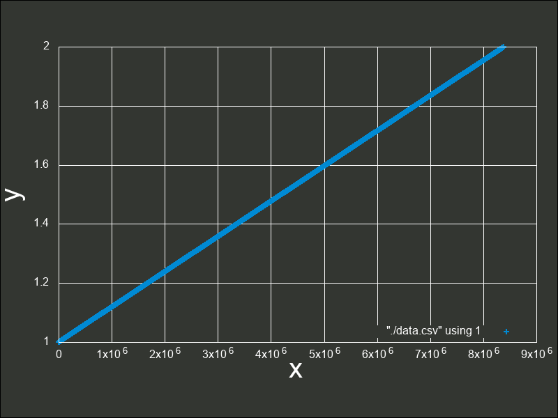
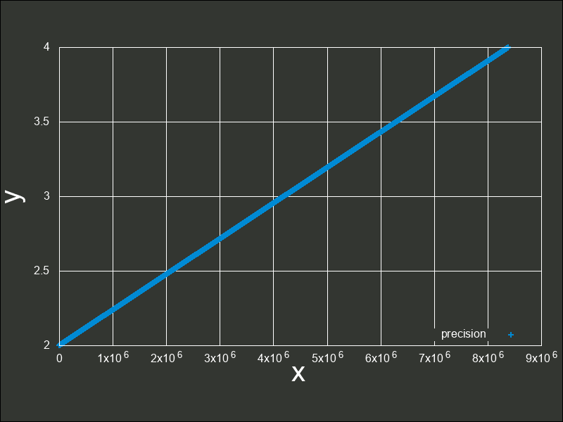
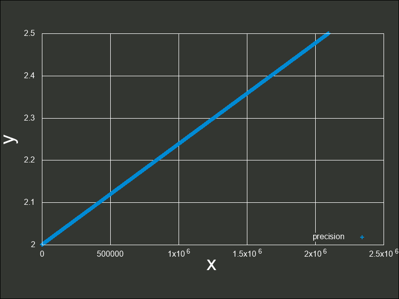
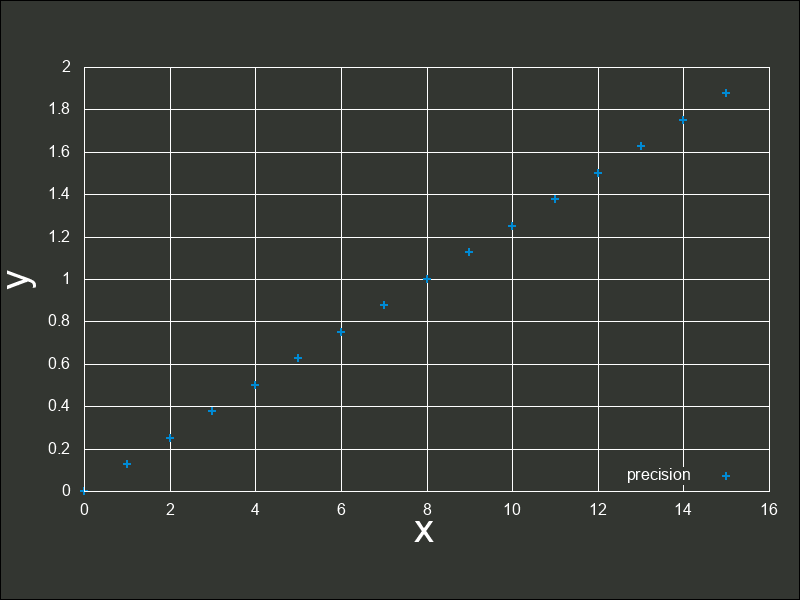
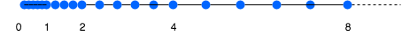

# 16.8 float のしくみ

この項では`float`型(本項で`float`型とは、後述する IEEE Standard for Floating-Point Arithmetic (ANSI/IEEE Std 754-2008) に準拠した`float`型についてを言います)のしくみと、それから考えられる性質などについて解説していきます。

## 16.8.1 コンピュータにおける「数」とはなにか
コンピュータにおける数と、数学の整数や実数は、よくよく考えると異なるものです。
コンピュータでは有限の記憶領域しかありません。よって、無数にある数を表すということは根本的に不可能です。
つまりコンピュータ上の「数」とは「本物の数になるべく似せた別の何か」と捉えることができます。
例えば、32 ビットの変数であれば  でおおよそ 40 億、16 ビットであれば同じようにして 65000、8 ビットであれば 256 種類表せることとなります。<br>
しばしば話題にも取り上げられる、2038 年問題とは、このようにコンピュータ上の数が有限数であることに起因します。この問題は、協定世界時における 1970 年 1 月 1 日 0 時 0 分 0 秒からの経過秒数(これを UNIX 時間といいます)を使用して時刻を表現するコンピュータ等のシステムで、その経過秒数が型の上限値を超えてしまうことで、時刻を正常に取り扱えなくなるといった問題です。UNIX 時間を利用しているシステムはこの世の中に多く存在します。この経過秒数を表現する型は、現在の標準では`time_t`型であり、C++ にも同様`<ctime>`に`std::time_t`型が定義されています。この型の実装詳細(範囲や精度)は、各実装に依存することとなっているため、厳密には定められていませんが、多くの伝統的な実装では`int`型を`time_t`としており、その`int`型は 32 ビットの型でした([2.1 変数とデータ型](../Chap2/21-変数とデータ型.md)で示している通り、C++ において`int`型は必ず 32 ビットであると定められているわけではありません)。`int`、すなわち`signed int`型の最大値は  です。この型で取り扱える経過秒数とは、せいぜい 2,147,483,647 秒( 68 年)までに限られているのです。よって、1970年 1 月 1 日 0 時 0 分 0 秒から 2,147,483,647 秒を経過した 2038 年 1 月 19 日 3 時 14 分 7 秒を過ぎると、この値がオーバーフローしてしまい、負と扱われてしまうため、この時刻の値を前提としたプログラムが誤作動してしまう可能性があります。

|  |
| -- |
| 上から2進、10進、オーバーフローの影響を受けた時刻、正しい時刻(by [Monaneko](https://commons.wikimedia.org/wiki/User:Monaneko) - Own work, [パブリック・ドメイン](https://en.wikipedia.org/wiki/Public_domain)) |

解決策としては、`time_t`を 64 ビットの整数型とするなどが考えられています。64 ビットの整数型にした場合、上限は  であり、年数に変換するとおよそ西暦 3000 億年にもなるため、事実上問題が発生することはありません。<br>
さて、2038 年問題は整数型における上限値の問題でした。しかし、型が異なっても、例えば`std::int32_t`型と`float`型でも、メモリを直接見てみれば単に 32 個の 0 と 1 が並んだものにすぎません。そのメモリ領域の読み方、使い方が異なるだけで、おおよそ 40 億種類の数字の組み合わせでしか表現ができないことは、全く同じです。<br>
この事実から、コンピュータ上の「数」とは「本物の数になるべく似せた、つまり近似的な別の何か」、また「限られた範囲の中で、型の性質ごとに色々表現方法をやりくりしている」ということをまずは抑えておきましょう。

## 16.8.2 2 進数の復習と固定小数点
実際に IEEE 754 の説明に入る前に、少し 2 進数に関してのおさらいと固定小数点に関して触れておきます。整数において  進数は、桁が上がるにつれて  の乗数を表しました。<br>


<br>
ところで、二進数で小数を表現する事はできるのでしょうか？もちろん、できます。fractional part 部はどうなるかというと、桁が下がるにつれて  の乗数、つまり  のマイナス乗を意味します。


<br>

2 進数でfractional part 分を表すことができることがわかりました。じゃあそれならば、整数型と同じようにして、ある一定の部分から下を小数として解釈し、そうでない部分を整数として解釈するようにして、単にビット列を並べれば良いじゃないかと思うかもしれません。
それは、まさに**固定小数点**と呼ばれる形態です。固定小数点とは、整数型を構成するビット列を、Number part と fractional part に分ける(符号部も扱う場合はそれに 1 ビットを費やします)ことで実現します。
例えば、 ビットのデータ型でこれを表現しようとした例が次の通りです。<br>


これは、fractional part を  ビット、Number part を  ビットとした場合の例です(固定小数点と呼ばれるものが必ずこの形式であるという決まりはありません。)。<br>
C++17 には、固定小数点を表現する型は標準では用意されていません(C++17 に標準で用意されているfractional part 分を扱える型として`float`と`double`がある事はもちろんご存知でしょう。この二つの型は本項のメインテーマである浮動小数点数を表す型であり、固定小数点と対比されることが多いです)。<br>
しかしながら、Number part とfractional part の管理を行えれば、固定小数点型を自作することはもちろん可能です。以下は符号なし固定小数点型をシミュレートした簡単なクラスです。
```cpp
#include <iostream>
#include <type_traits>
#include <climits>
#include <cstdint>
#include <cmath>

//! TPLCXX17 namespace
namespace TPLCXX17 {
////! chapter 16.8.1 namespace
namespace chap16_8_1 {
////! version 1 namespace
namespace v1 {

/**
 * @class simply_fixed_point
 * @brief 簡素化された符号なし固定小数点数型のシミュレートクラス
 * @code
 * int main()
 * {
 *     TPLCXX17::chap16_8_1::v1::simply_fixed_point fp(static_cast<std::uint16_t>(42));
 *     std::cout << fp << std::endl; // 42
 *
 *     fp = TPLCXX17::chap16_8_1::v1::simply_fixed_point::convert_fixed_point(1.23);
 *     std::cout << fp << std::endl; // 1.23047
 * }
 * @endcode
 */
class simply_fixed_point {
    // 1 バイトは 8 ビットでなければならない
    static_assert(CHAR_BIT == 8);
public:
    //! 32 ビット符号なし領域を用います
    typedef std::uint32_t value_type;
private:  
    //! fractional part のビットサイズを表します。
    inline static constexpr value_type fractional_size = 8;
    
    /**
     * @class is_integral
     * @brief コンストラクタで SFINAE を行うためのヘルパーです
     */
    template <class T>
    struct is_integral
        : std::conjunction<std::is_unsigned<T>, std::bool_constant<(sizeof(T) <= (sizeof(value_type) * CHAR_BIT - fractional_size) / CHAR_BIT)>> {};
public:
    /**
     * @brief デフォルトコンストラクタ
     */
    constexpr explicit simply_fixed_point() = default;

    /**
     * @brief Number part コンストラクタ
     * @param x is_integral に沿うデータ型 T。SFINAE で失敗しなかった場合、それが問答無用で 24 ビット以下の整数値であるとみなします。
     */
    template <class T, std::enable_if_t<is_integral<T>::value, std::nullptr_t> = nullptr>
    constexpr explicit simply_fixed_point(T x) : data_(std::move(x))
    {
        data_ <<= fractional_size;
    }

    /**
     * @brief 固定小数点型を受け付けるコンストラクタ
     * @param x is_integral に沿わないデータ型 T。SFINAE で失敗しなかった場合、それが問答無用で固定小数点型の形式にビット列が並んでいるものとみなします。
     */
     template <class T, std::enable_if_t<std::negation<is_integral<T>>::value, std::nullptr_t> = nullptr>
     constexpr explicit simply_fixed_point(T x) : data_(std::move(x)) {}

     /**
      * @brief Number part 代入演算子
      * @param x is_integral に沿うデータ型 T。SFINAE で失敗しなかった場合、それが問答無用で 24 ビット以下の整数値であるとみなします。
      */
     template <class T>
     constexpr std::enable_if_t<is_integral<T>::value, simply_fixed_point&> 
     operator=(T x)
     {
         data_ = std::move(x);
         data_ <<= fractional_size;
         return *this;
     }

     /**
      * @brief 固定小数点型を受け付けるコンストラクタ
      * @param x is_integral に沿わないデータ型 T。SFINAE で失敗しなかった場合、それが問答無用で固定小数点型の形式にビット列が並んでいるものとみなします。
      */
     template <class T>
     constexpr std::enable_if_t<std::negation<is_integral<T>>::value, simply_fixed_point&> 
     operator=(T x)
     {
         data_ = std::move(x);
         return *this;
     }

     /**
      * @brief 浮動小数点数型から固定小数点型の値に変換するヘルパ関数
      * @param x 浮動小数点数型の値
      * @return @a x を固定小数点型に変換した値
      */
     template <typename FloatingPoint>
     static constexpr std::enable_if_t<std::is_floating_point<FloatingPoint>::value, value_type> 
     convert_fixed_point(FloatingPoint x)
     {
         // 2 の fractional_size 乗かけた値
         return static_cast<value_type>(std::round(x * std::pow(2, fractional_size)));
     }
private:
     /**
      * @brief 標準出力ライブラリライクなシフト演算のオーバーロード
      * @param os std::ostream のオブジェクト
      * @param this_ simply_fixed_point のオブジェクト
      * @return @a os
      */
     friend std::ostream& operator<<(std::ostream& os, const simply_fixed_point& this_)
     {
         return os << this_.data_ / std::pow(2, fractional_size);
     }

     //! Number part とfractional part にわけた固定小数点の領域として使います
     value_type data_ = 0;
};

} // namespace v1
} // namespace chap16_8_1
} // namespace TPLCXX17
```
固定小数型の特徴は、**表現できる幅が非常に狭く、値が増えても精度は一定であるという点です**。<br>
上述の固定小数点型における形態では、 までの小数点しか扱う事ができません。また、Number part は残りの  種類のビットパターンしか表せません。
しかしながら、精度はどのような値になっても一定であるため、これから説明する浮動小数点数と比較すると、これは良くもあり、悪くもあると言えるでしょう。
なお上記の実装では簡単のため、符号部のない固定小数点となっていますが、符号部も取り扱った[筆者による実装例](https://github.com/falgon/SrookCppLibraries/tree/master/srook/numeric/fixed_point)や、現在のところ標準には搭載されていませんが、[C++ 標準化委員会に提出された固定小数点型の提案](https://github.com/johnmcfarlane/fixed_point/blob/develop/doc/p0037.md)やその[サンプル実装](https://github.com/johnmcfarlane/fixed_point/tree/develop/include/sg14)などを見ることができます。

## 16.8.2 float の中身
固定小数点型では、表せる数値の範囲が狭くなってしまうことがわかりました。ここからは、C++ にも標準で搭載されている浮動小数点数型について説明していきます。<br>
符号なし 32 ビット整数を解釈する際には、32 個の 2 進ビットをそのまま読みます。また符号つきである場合は、[16.6 補数](./166-complement.md)で説明した通り補数を用いてその値を表現しました。<br>
では、`float`は一体どのようにして値を表現しているのでしょうか。
C++ における`float`型とは、**単精度浮動小数点数型**と言われる浮動小数点型であり、前述した通りビット列によって実数を表現します。
その表現方法は、国際標準規格 **IEEE Standard for Floating-Point Arithmetic (ANSI/IEEE Std 754-2008)**(以下これを IEEE 754 と称します)として 5 種類定められており、以下に示す形式は、同国際標準規格のうちの 1 つである、**binary32** という形式です。一般的な実装では、C++ における`float`型はこの形式に則って実装されます。


<br>
各用語は次の通り対応します。<br>
<br>

IEEE 754 では上図のように、32 ビットを 3 つに分割し、一番右側を 0 ビット目とし、一番左側を 31 ビット目とします。
そしてなによりも特徴的なのが、指数と仮数で数値を表現するという点です。
このような表現をする理由は、まさに固定小数点型における問題であった、表現できる数値範囲が狭い問題を解決するためです。
10 進数の実数値から、この IEEE 754 binary32 フォーマットへの変換は、大まかには次の手順で行います。

1. 実数値を  というようにNumber part とfractional part で表現するものとする。
2. Number part を二進法で表現したものに変換する
3. fractional part を以下に示す技法で変換する
4. 2 つの変換結果を組み合わせ、さらに変換を加えて最終的な表現を得る。

なお、上図のビット列は、 を表す IEEE 754 準拠のビット列です。これをふまえて、 という数値を順番に IEEE 754 形式に変換していきながら、その形式や特徴を説明します。

### 符号部

まずは符号部についてです。これはシンプルで、正ならば  が、負ならば  がこの部分に入ります。現時点では次のようになります。<br>


### 仮数部

次に、仮数部です。上図の通り、23 ビットで  の仮数を表現します。<br>
次の順番で仮数部を得る事ができます。

1.  を  と  に分離する
2. それぞれ 2 進に変換し、 、
3. 合わせて、
4. Number part 分に  がくるように、小数点を移動する。この場合、 から 小数点の位置を左に 3 つずらすとNumber part 分に 1 がくるので、(これを**正規化**といいます)
5. 必ずNumber part 分に  がくるため、これを省き、あるものとして認識する。
6. 空いている箇所に を埋める

この手順は、より形式的に要約すると次のようになります。

1.  を  という仮数と指数表現の形に変換する
2. 必ずNumber part 分に  がくるため、これを省き、あるものとして認識する。
3. 空いている箇所に  を埋める

ここまでで、次のようになりました。


<br>
仮数部の表現は、前述した通り仮数部の直前に小数点があるという前提で行われています。
また 5 によって、仮数部で表現されるビット列の一つ上の桁に暗黙の 1 ビットがあるとみなせるため(これをいわゆるケチ表現と言ったりします)、実際の仮数部のビット数は 23 ビットですが、実質的には 24 ビット相当の精度で表現する事ができるという事です。なお 5 などでは、必ずNumber part 分に  がくると述べていますが、これには一点例外があり、変換する値が  であった場合が該当します。
その場合、仮数部とこの後に説明する指数部も含めて全て  になります。このときの値は、 を表現します。
<br>
ところでなぜ浮動小数点数が浮動小数点数と言うのかがこれで分かったはずです。仮数部で小数点の位置が変わる事から、浮動小数点数と言われているのですね。

### 指数部
最後に指数部です。ここには、仮数部で動かした桁数を表します。よって指数部は  となります。
このとき、 ですから  が指数部の値となりそうです。しかし、指数部の表現は 2 の補数表現を用いない、つまり符号なしとして扱います(大小比較の単純化のためです)。<br>
では、指数部でマイナスを表現したいときはどうすれば良いのでしょうか。それは、**仮数部で動かした桁数 +  をして、符号なしの範囲のみで表現できるようずらす事で表現します。**
このようにある値を一定の基準値からの間隔で表した値をオフセットまたはオフセット値、そのような形態の表現をオフセット表現と言います。また、このときの  をバイアス値といったりします。<br>
 に対してバイアス値  を加えると、 となります。この値を指数部に入れ、次のようになりました。<br>


<br>
というわけで、 を IEEE 754 準拠の浮動小数点数に変換する事ができました。なお、指数部に関しても一点例外があり、指数部の全てのビットが 1 で、仮数部が  である場合、無限大()を表現します。<br>

### まとめ
冒頭で  という数値を  と表現したように、IEEE 754 も 2 進数上でこのように仮数と指数を組み合わせて利用することで、値を表現します。
このように、指数と仮数によって数値表現を行う事で、どのような影響がでるのかについては後述していますが、まずは利点として、**少ないビット数で広い範囲を表現できる方法である**ということを、ここまでで実感できたはずです。

最後にもう一度練習として、別の値を IEEE 754 準拠の値に変換して見ましょう。例として  を変換して見ます。符号部は正ですから、まずは次のようになるはずです。<br>


<br>
次に、 を指数と仮数で表現していきます。
冒頭で述べた通り、2 進数上で数値は一桁あがるごとに  乗、下がるごとに  乗になりますから、指数もそれに応じて表現できます。
つまり、 ということです。
仮数部に実際に入る値は、先頭の 1 ビットを取り除きますから、現時点で次のようになります。


<br>
指数部には先ほどの指数  を表現します。バイアス値である  を加えて  です。よって<br>

<br>
となります。<br>
因みに C++ には`std::bitset`が用意されています。これを次のように利用して、浮動小数点数のビット列を確認できます。
```cpp
#ifndef DOXYGEN_SHOULD_SKIP_THIS
#include <iostream>
#include <bitset>
#include <cstring>
#include <climits>
#include <limits>

int main()
{
    typedef float floating_point;
    static_assert(std::numeric_limits<floating_point>::is_iec559);
    
    floating_point a = 25.625f;
    std::uint32_t dst;
    std::memcpy(&dst, &a, sizeof dst);
    std::cout << std::bitset<sizeof(std::uint32_t) * CHAR_BIT>(dst) << std::endl;
}
#endif
```
なお、少し浮動小数点数の話題からはそれてしまいますが、次のようにキャストして利用してはなりません。
```cpp
#ifndef DOXYGEN_SHOULD_SKIP_THIS

float a = 25.625f;
std::cout << std::bitset<sizeof(float) * CHAR_BIT>(*reinterpret_cast<unsigned long*>(&a)) << std::endl; // strict aliasing ルール違反

#endif
```
これは`std::bitset`に限られた話ではなく、C++ の strict aliasing ルールに違反するコードであるため、未定義の動作を引き起こします。
strict aliasing ルールに関しましては、 [16.1 strict alias rule](161-strict_alias_rule.md) にて説明しています。

## 16.8.3 IEEE 754 における特例/例外事項のまとめ

* 指数部が全て  であり、仮数部が  であるとき、無限を表現する。
* 全てのビットが 0 である場合  を表現する

とこれまでの説明で述べました。さらに加えて、

* 指数部が全て  であり、仮数部が  でないとき非数 (Not a Number/NaN) を表現する

という決まりがあります。非数とは、例えばゼロ除算などを行うとこの値になります。NaN は quiet NaN と signaling NaN の二種類があり、
C++ においてはそれぞれ`std::numeric_limits<float>::quiet_NaN()`とstd::numeric_limits<float>::signaling_NaN()`とすることで取得できます。両者の違いは、シグナルを発生しないか、するかの違いがあります。

さてでは、これらを除いた実際の数値として扱える範囲を、実際に確認してみましょう。
まずは正の数における最小値です。<br>


まずはこの指数部に着目します。指数部は  となっていますが、これはここまで説明してきた通り、バイアス値である  を加えると  になる値を意味します。
よって、 です。
また仮数部は、仮数部の説明で述べた通りケチ表現がされているため、つまり、 という表現であるため、値は  です。
よってその値は、 となります。
ところで、これよりも小さな値(`std::numeric_limits<float>::min()`よりも小さな値)、すなわち最小正規化数よりも絶対値が小さな値は問答無用で  になってしまう(このようなことを一般に**アンダーフロー**といいます)のでしょうか。IEEE 754 は、これを突然  にアンダーフローをさせないために、最小正規化数よりも絶対値が小さな値に対しては例外的に、ここまでの説明とは少し異なった特別な解釈方法を用いてその値を表現する事としているのです(これは、gradual underflow、直訳して段階的なアンダーフローとも呼ばれます)。
具体的には、指数部が  、仮数部が  でないときを条件として、それが最小正規化数よりも下回った値であり、かつ正規化数とは異なる値の表現方法であることを示します。
これを、**非正規化数 (Denormalized Number)**といいます。文字通り、これは正規化をしないで値を表現する方法です。最小正規化数を下回ったら、実際の指数部のビット列は  ですが指数を  (指数部における最小値。バイアス処理済みの値)として固定、解釈し、仮数部にそのまま固定小数点のように(ケチ表現などもせず)入れてしまうというようにします。すると、

 <br>
 <br>
<br>
 <br>
 <br>
<br>
 <br>のような表現ができるようになります。このとき、本来  ビットあるべき仮数部の長さが減ってしまっており、精度が低下していることがいえます。なお、非正規化数の最小の値は C++ において`std::numeric_limits<float>::denorm_min()`で取得することができ、`std::numeric_limits<float>::has_denorm`によって、環境が非正規化数をサポートしているか判定することができます。
```cpp
#ifndef DOXYGEN_SHOULD_SKIP_THIS

#include <limits>

constexpr std::float_denorm_style b = std::numeric_limits<float>::has_denorm;
if constexpr (a == std::denorm_indeterminate) {
    // ...
} else if constexpr (a == std::denorm_absent) {
    // ...
} else if constexpr (a == std::denorm_present) {
    // ...
}

#endif
```
各定数は次のように定義されています。

| 値 | 非正規化数のサポート状況 |
| -- | -- |
| `std::denorm_indeterminate` | 許可するか判定できない |
| `std::denorm_absent` | 許可しない |
| `std::denorm_present` | 許可する |

さらに、精度の損失の原因が、非正規化数によるものであるかどうかを`std::numeric_limits<float>::has_denorm_loss`によって判定することができます。<br>
さて非正規化数そのものは、エラー値というわけではないので、NaN などと比較すると計算を続行することができますが、正規化数がハードウェアによって処理されるのに対して、
非正規化数は多くの場合ソフトウェアで実現しているという現状から、非正規化数を使った計算は正規化数による同じ計算よりも性能が悪くなる傾向にあります。
ハードウェア実装によってはこのような事実から、演算結果に対して非正規化数を用いることとなる値が算出されたとしても、ゼロに丸めるといったような機能のあるものも存在します。<br><br>
次に、最大値について考えて見ましょう。<br>


<br>
同じく指数部に着目します。指数部は、バイアス値を加えて  となる値ですから、 です。また仮数部は先ほどと同様にして という意味になりますから、これはおおよそ  です。よってその値は  となります。この値を超えるとき、無限を表現することとなり、これを一般に**オーバーフロー**といいます。

最後に、これらについてまとめておきます。

| 特例/例外事項 | 指数部の値 | 仮数部の値 |
| -- | -- | -- |
|  |  |  |
| 非正規化数 |  |  以外 |
| 正規化数 |  | 任意 |
| 無限大 |  |  |
| NaN |  |  以外 |

## 16.8.4 精度と誤差
IEEE 754 binary32 の表現方法は、非常に広い範囲の数値を表現できることがわかりましたが、この表現方法には欠点もあります。
それは、誤差が生まれるということです。
例えば  といった数値の場合、これを 2 進で考えると、 と循環してしまいます。
有限桁しか扱えないコンピュータ内部では、どこかで打ち切るしかありません。この打ち切りによって、真の値との誤差が生まれてしまいます。<br>

これだけならばまだ良いのですが、更に付け加える必要があります。
例として、 と  を IEEE 754 binary32 の形にすると次のようになります。

 <br>
 <br>
この場合、二つの数値の中間値は仮数部の分、すなわち 23 ビットのパターンで表すことができます。 830 万ですからこの間では非常に精密に表現できる事が分かりますね。<br>
次に、 も並べて見ましょう。<br>
<br>
 と  の中間値は、どれだけのパターンで表現することができますでしょうか。さきほどと同じく、これまた 23 ビットのパターンで表します。<br>
続いて、 も見て見ましょう。<br>
$$ 8.00\cdots=\overbrace{
\overbrace{\underbrace{0}_{({\bf s}ign)}}^{1bit}
\overbrace{\underbrace{10000010}_{({\bf e}xponent)}}^{8bit}
\overbrace{\underbrace{00000000000000000000000}_{({\bf f}raction)}}^{23bit}}^{32bit} $$<br>
 と  の中間値は、どれだけのパターンで表現することができますでしょうか。同じく、23 ビットのパターンで表します。<br>

最後に、 億と  億を同じ形式にして見て見ます。


 億と  億は同じようにして、23 ビットのパターンで表現されます。<br>
さて、これらは、**数が大きくなればなるほど、仮数部における 23 ビットのパターンが引き伸ばされることから、結果として数値間の精度が落ちていく**ということを示しています。
 と  の間では 830 万通りの表現ができますから、それなりに精密な小数点を扱えることが分かります。
しかし、 億もの数値になると、そこから  億までの間を 830 万 通りのみで表現する事となるのですから、これは明らかにいくらかの極端な誤差が生じることが予想できます。
binary32 の表現方法の必然として、大きな値を扱うためには指数部の値を大きくしていく必要があります。
指数が 1 つあがれば値は爆発的に増加します。これまで述べてきた通り、仮数部は、その指数値間の値を表現しなければなりません。
これらの事から、値を上げていくと、やがて 23 ビットのみでは(つまり 830 万通りでは)その指数値間の値を表現できるどこかで近似的に保持していくこととなり、最終的には整数単位ですら表現できなくなることがわかります。<br>

次のグラフは、 から  の間の精度を元に点でプロットしたものです。 より二つの値の差異は  です。これを  で分割して表現しますから  の精度でこの間を表現できることになります(IEEE 754 binary32 実装の`float`型の環境において、`std::numeric_limits<float>::epsilon()`(`epsilon`という名前の定義は、後述しています)とすることで、同様の値を取得できます)。この値を**誤差幅**(また後に説明する Absolute error)といいます。ここから考えられるように、またグラフからもわかるように、これは点でのプロットを行なったグラフですが、点があまりにも高密度であるためほぼ線のように見えています。



次の図は、 から  の間の精度を元にプロットした図です。
両者の差は  でこれを  で分割しますから となります。誤差幅が増えていることが分かりますね。
グラフにして見てみるとまだ視覚的には特別差異がないようです。



これは、 から  間の誤差幅と同じ誤差幅で、 までをプロットしたグラフです。
このように拡大してみても、現時点ではまだ密度が高いと言えます。



このまま 1 ずつ指数を進めていても、誤差幅はその指数に比例して広がっていくためグラフの変化はあまりないので、一気に  と  間に飛ぶこととします。
二つの差異は  です。これを  で分割しますから  となります。誤差幅が一気に増えましたね。<br>
ここでは比較を用意にするために、 から  間の精度を単にプロットするのではなく、 から  間の精度をプロットします。<br>
また、誤差幅さえあっていれば、何も  から  を愚直にプロットする必要はなく、 から  を誤差幅  でプロットします。
寧ろ、これまで述べてきたように、大きな値を用いた演算は誤差幅が大きくなりますから、正しくプロットするためにはできる限り小さい値を用いて行った方が良いことは想像に容易いでしょう。



ついに誤差がグラフ上でも確認できるようになってしまいました。
値は当然ながら、このグラフ上の点のどこかでしか表現する事ができないので、点と点の間の数値がもし発生したとしても、このどれかの点上に強制的に合わされます。
このような、切り捨て、切り上げによって有効桁数未満の桁を削除することによって発生する誤差を、**丸め誤差(Round-off error)**といいます。丸め誤差のイメージは、次の図の通りです。



ところで、いずれ整数単位ですら表現できなくなると前述しましたが、その境界はどこからでしょうか。それは、誤差幅が  よりも大きくなったときです。
誤差幅がちょうど  となるのは、差が  となるときですね()。
それは当然、 から  の間となるので、 よりも大きくなった途端に整数単位での表現も正常に行えなくなるということになります。
これを試して見ましょう。
```cpp
#ifndef DOXYGEN_SHOULD_SKIP_THIS
#include <iostream>
#include <bitset>
#include <limits>
#include <cstring>
#include <climits>
#include <cmath>

struct print_bit {
    constexpr explicit print_bit(float f) : data_(std::move(f)) {}
private:
    float data_;

    friend std::ostream& operator<<(std::ostream& os, const print_bit& this_)
    {
        static_assert(std::numeric_limits<float>::is_iec559);
        std::uint32_t ui;
        std::memcpy(&ui, &this_.data_, sizeof ui);
        return os << std::bitset<sizeof ui * CHAR_BIT>(ui);
    }
};

std::string round_style()
{
    if constexpr (constexpr std::float_round_style fs = std::numeric_limits<float>::round_style; fs == std::round_toward_zero) {
        return "toward zero";
    } else if constexpr (fs == std::round_to_nearest) {
        return "to nearest";
    } else if constexpr (fs == std::round_toward_infinity) {
        return "toward infinity";
    } else if constexpr (fs == std::round_toward_neg_infinity) {
        return "toward negative infinity";
    } else {
        return "indeterminate";
    }
}

int main()
{
    // 丸め方式を出力
    std::cout << round_style() << std::endl; // 筆者の環境では to nearest

    const float f1 = std::pow(2, 23); // 2 の 23 乗
    // 1 は正常に足される
    std::cout << print_bit(f1 + 1.f) << std::endl;  // 01001010100000000000000000000001
    // 丸め方式によって実際の値は変わり得るものの正常には足されない
    std::cout << print_bit(f1 + 0.5f) << std::endl; // 01001011000000000000000000000000

    const float f2 = std::pow(2, 24); // 2 の 24 乗
    // 単に出力
    std::cout << print_bit(f2) << std::endl; // 01001011100000000000000000000000
    // 丸め方式によって実際の値は変わり得るものの正常には足されない
    std::cout << print_bit(f2 + 1) << std::endl; // 01001011100000000000000000000000
}
#endif
```
このコードとコメントにある実行結果では、`f1 + 0.5f`と`f2 + 1`の演算でそれぞれ`+ 0.5f`と`+ 1`が完全に無視された結果となっていますね。このような現象を**情報落ち**といいます。
 は誤差幅が  であるため、 を足そうとすると、後に説明する丸め処理によって、 単位で表せる前後どちらかに丸められてしまいます。
その結果、`+0.5`は無視されてしまいました。
また、 になった途端、誤差幅が  であるため、 を足そうとすると、同じようにして丸め処理によって  単位で表せる前後どちらかに丸められてしまいます。
その結果、`+1`は無視されてしまいました。<br>
浮動小数点数を用いた得られる最終的な数値は、丸め方法の違いによって異なります。つまり、たまたま正常な数値が得られる事もあります(しかしそのような演算の信頼性はあまりありません)。<br>
一旦、ここではその丸め方法について触れておきます。上記コードでは、`round_style`関数によってその丸め方法を取得しています。
IEEE 754 による最も推奨された丸め方法は、**最近接偶数丸め**という丸め方式です。これは、端数が  未満である場合は切り捨て、端数が  未満より大きければ切り上げ、端数がちょうど  である場合は切り捨てと切り上げのうち結果が偶数となる方へ丸めるという方式です。四捨五入との違いは、端数がちょうど  である場合の丸め方が異なります。例えば  を丸める場合、四捨五入した結果は  です。しかし最近接偶数丸めの場合は  になります。いくつかその違いを表にすると分かりやすいでしょう。

| Theoretical value | 四捨五入 | 最近接偶数丸め |
| -- | -- | -- |
| 0.5 | 1 | 0 |
| 1.5 | 2 | 2 |
| 2.5 | 3 | 2 |
| 3.5 | 4 | 4 |
| 4.5 | 5 | 4 |
| 5.5 | 6 | 6 |
| 6.5 | 7 | 6 |

一般的にこの丸め方法は、四捨五入といったどの丸め方法よりも優れているとされています。
その理由は、丸めた結果の総和を比較すると分かります。

| Theoretical valueの合計 | 四捨五入の合計 | 最近接偶数丸めの合計 |
| -- | -- | -- |
| 24.5 | 28 | 24 |

Theoretical valueの合計に、最近接偶数丸め方式の値の合計の方が近い事が分かります。四捨五入の問題は、 という中間値を切り上げる方向に丸めることにあります。本来  は切り上げる方向でも切り下げる方向でもないどっちつかずの値のはずです。これを切り上げてしまうがために、それを繰り返した値の総和は、その誤差が蓄積していきTheoretical valueの合計から離れてしまうのです。<br>
しかし最近接丸め方式は、 という中間値を問答無用で切り上げるのではなく、Number part が偶数のものと奇数のものでそれぞれ切り捨てと切り上げを行うようにしているため、この誤差を相殺しあえるのです。
因みに、C++11 以降では`<cmath>`ヘッダーに`std::nearbyint()`関数が標準搭載されており、この丸め方式を利用することができます。四捨五入は、同ヘッダー`std::round()`で行うことができます。
<br>では、これを実際の浮動小数点数に対して適用し、浮動小数点数として現れる数値を推測してみましょう。例えば、 という数値は大きい方に丸められ  という数値は小さい方に丸められると考えることができます。
 は  と  の間にあります。この間、つまり  を仮数で表現しますから約  の誤差幅で表現することになります。ということは、その  の間隔で表現できない値はどうにかして丸められるということです。よって例えばその半分である  をこの範囲内で適用しようとすると、最近接偶数丸によって大きい方へ、 であれば小さい方へ丸められます。<br>

なお、この最近接偶数丸め方式以外にもいくつか丸め方式があり、上記コードにも出てきていますが、`<limits>`ヘッダーにて次の通り`std::float_round_style`という列挙型にて判別できるよう定義されています。

| 列挙値 | 説明 |
| -- | -- |
| `round_toward_zero` | 0 に向かって丸めます |
| `round_to_nearest` | 最近接偶数で丸めます |
| `round_toward_infinity` | 正の無限方向に向かって丸めます |
| `round_toward_neg_intinity` | 負の無限方向に向かって丸めます |
| `ronud_indeterminate` | 丸めスタイルが確定しません |

`round_to_ward_infinity`は、`<cmath>`ヘッダに定義される`std::ceil`、また`round_toward_neg_intinity`は、同ヘッダに定義される`std::floor`関数と、動作が対応しています。
また、これは実装依存ですが、異なる丸め方式がサポートされている処理系では、任意に丸め方式を設定することができます。
```cpp
#ifndef DOXYGEN_SHOULD_SKIP_THIS

#include <cfenv>
#   pragma STDC FENV_ACCESS ON
std::fesetround(FE_DOWNWARD); // 負の無限方向への丸めに設定する
std::fesetround(FE_UPWARD); // 正の無限方向への丸めに設定する
std::fesetround(FE_TOWARDZERO); // 0 方向への丸めに設定する
std::fesetround(FE_TONEAREST); // 最近接偶数丸めに設定する

#endif
```
`pragma`ディレクティブは、規定の丸め方式以外の丸め方式で浮動小数点数を利用するかもしれないことを、処理系に伝えます。
これによって、最適化などによる設定を無視した浮動小数点数演算を回避します。

## 16.8.5 閉性
整数同士の演算において、加算、積算、また減算(乗法)は、どのような数値同士でも必ず結果は整数です。しかしながら整数同士の除算は、整数の組み合わせによっては結果を整数で表せません。
これを、数学において「整数全体の成す集合は、乗法について閉じているが除法について閉じていない」といいます。このような、ある集合の元に対して演算を施した結果が再びもとの集合に属することを「閉じている」、また「閉性(closure property) をもつ」と言います。<br>
実数における閉性は、どのように考えられるでしょうか。実数とは複素数でない数、つまり「普通の数」のことをいいますから、実数に対する四則演算は全て閉じている事が言えます。<br>
では、浮動小数点数における閉性は、どのように考えられるでしょうか。
浮動小数点数は、四則演算のいずれに対しても閉じていないと考えられます。なぜならば、これまでも述べてきた通り浮動小数点数は"よく似た数"、すなわち"実数を模した別の数"で強制的に置き換えるものであり、閉性の定義における、演算結果が再び元の集合に属する、ということを満たさないからです。

## 16.8.6 誤差とスケール
これまで実数を近似的に表現する幅を、つまり実際のTheoretical valueとの違いを、誤差幅というように述べてきました。<br>
ここで、誤差とは何なのかについて改めて少し触れておきます。
例えば次の 2 つの事例を見て見ましょう。

1.  kg の物体の重さを測定したら、 kg であった。
2.  kg の物体の重さを測定したら、 kg であった。

なお、上記 2 つの事例は理想的な状況における誤差であるとします。そのような状況下における誤差を**偶然誤差**といいます。
また、「 kg の物体の重さを測定したら、」の「 kg」といったような本当の実際の値のことをここではTheoretical value、またTrue value、「 kg であった。」といったような測定などによって得られた結果の値をここではMeasured valueと呼びます。
<br>さて、このとき誤差幅は 1 と 2 両方とも  kg です。しかし、2 よりも 1 の方が大きい誤差であるように思えます。
 kg の物体の重さを  kg も計り間違えることは重大な誤差です。
しかし、 kg の物体の重さを  kg 計り間違えることは、前述した事例よりも重大ではないように思えます。
このように、誤差をスケール(数字の大きさ、桁数）に関係なく、Theoretical valueからの幅だけで表すことを、主に** Absolute error**と言います。
反して、スケールを考慮して比率で表された誤差を** Relative error**と言います。 Absolute error と  Relative error には次のような関係があります。<br>

<br>
<br>
これら二つの式は、分かりやすいよう単に変形しているだけで、それぞれ同じ事実を示しています。<br>
この関係を利用して 1, 2 の事例をそれぞれ Relative error で表すと、
1 は () の誤差、2 は ()の誤差であると言え、両者の誤差の比率を伺うことができます。<br><br>
これらの概念を浮動小数点数と交えると、浮動小数点数の説明はより明確になります。浮動小数点数は、上のプロット図や説明からもわかるように、離散的に値が存在すると言え、表現可能な数値の間には隙間ができることがわかりました。<br>
これに対してこの隙間は、「指数部が大きくなるにつれて絶対的な距離は大きくなるが、相対的な距離はほぼ等しい特徴がある」と説明できます。
この間隔を、**マシンイプシロン (machine epsilon)**と言います。この値は、前述した通り`std::numeric_limits<float>::epsilon()`によって取得することができ、これは`FLT_EPSILON`という定義済みマクロに対応しています。

## 16.8.7 傾向
浮動小数点数では、どのような演算を行っても必ず誤差がでるということが分かりました。また、これまでの説明から誤差幅の大きさは値が大きくなるほど大きくなっていくということが分かりました。
さらに、誤差にはスケールの違いがあり、 Absolute error と Relative error というそれぞれの考え方で、それが何を示しているのかを明確に伝えることができるということが分かりました。

ここでは、今まで説明してきた浮動小数点数の特性から、各演算における誤差をどの程度見積る必要があるのかについて説明します。
これを知ることは、可能な限り誤差を抑えたコードを書くために有益であるはずです。<br>

### 加算
 について考えます。
このとき、各  が  の Absolute error を持っている場合、演算結果から取得できる  は  の Absolute error を持っていることになります。<br>
つまり、加算の結果のもつ Absolute error は、元の値の Absolute error の和となることが言えます。
例えば、各  の Relative error  が  であるとき、各  は  または  となります(前述の公式にあてはめると、この通りになります)。
よって演算から求められた結果は 、、 のうちのどれかとなるでしょう。
この事実から、同じ Relative error をもつ数値同士の加算の結果における Relative error は同じになるということがいえます
(例えば、 という式があるとき、 が  の Absolute error を持つとした場合、  の Relative error は  です。
対して、 が  の Absolute error を持つとした場合、 Relative error は同じく  です。
さらに、この演算結果である  は、後の説明で証明している通り  の Relative error を持っています。
このように同じ Relative error を持つ数値同士の加算の結果値の Relative error は、元の値と同じ Relative error となります。)。
これは異なる Relative error 、つまり異なるスケールを互いにもつ数値同士の加算においては、これを適用できないこともわかるはずです。

この法則性を明確にするため、以下数学的に説明します。<br>
量  の実験値として  各実験値の Absolute error  (数学、物理学において  は差を表すときに用いられることがあります)があるとき、これらの量から誤差付きの量  を算出し、各誤差  が ()に影響を与えるとき、これを誤差が**伝播する**といいます。
前述したとおり Absolute error は、 という加法によって、 の Absolute error   に対し
 というように伝播します。
このとき、量  、すなわち  を大きく見積もった場合、
 と表せ、量  を最も大きく見積もった場合の値を  としたとき、 と見積もることができます。
また、量  を小さく見積もった場合、すなわち  を小さく見積もった場合、
 と表せ、量  を最も小さく見積もった場合の値を  としたとき、 と見積もることができます。

さらに  であるとき、
 がなりたち、
部分式  が Theoretical value の集合値であることは明らかですから、 
 、  と表せます。よって、
 がなりたちます。
これは、全ての元の値が同じ Relative error を持つ場合、その加算結果の Relative error は元の値の Relative error と同じであることを示しています。

### 減算
 について考えます。
このとき、 が  の Absolute error を持っている場合、 は  の Absolute error をもっていると分かります。
減算の場合も、この Absolute error は加わります。すなわち、 の結果である  は  の Absolute error を持っています。<br>
例えば、Relative error   が  であるとき、この演算における最大誤差が発生するパターンは  が 、 が  であった場合と、 が 、 が  であった場合でしょう。結果としてそれぞれ 、 となり、 Absolute error は  というように加わっていることが分かります。<br>
加算の場合と同じく数学的に説明します。話を単純化するため、量  を  とします。
量  を大きく見積もった場合、 としたとき、 と見積もることができます。
小さく見積もった場合、 としたとき、 と見積もることができます。<br>

浮動小数点数の演算において、減算は最も誤差を含んでしまう演算です。これを体感するために、 について考えてみます。このときの Absolute error は  です。
 Relative error が であるとき、小さく、また大きく見積もるとき、公式にあてはめると  の Absolute error があることがわかり、それぞれ 、 であることがわかります。このような誤差範囲の広さがある演算結果は、到底あてにできるものではありません。<br>
このようなほぼ等しい数値は、上位桁が等しく、下位桁だけ異なるという状態になっているはずです。そこで減算を行うと、上位桁は相殺され  になります。そして、わずかな下位桁だけの差が結果として現れる事になります。このとき、正規化によって、現れた下位桁の後ろ側に  を詰められることになります。この詰められた値  は計算によって導かれた値ではありませんが、**それが正常に計算された結果として  なのか、このような正規化によって作られた  であるのかは、計算結果だけを見ても区別することはできません**。このようにして、本来保持していた有意な数値の桁数が減ってしまうことを**桁落ち**と言います。<br>

 <br>
ご覧の通り、有効桁数が  になってしまいました。重要なのは、繰り返しになりますが、この計算結果だけを見たとき、それが桁落ちとして詰められた値なのかそうでないのかが区別できないということです。
つまり、有効桁数の減少は、計算精度(信頼性)の悪化そのものです。そして一度減った有効桁数はもう回復することはできません。<br>
これを防ぐためには、減算そのものを行わないことが一番ですが、そのようなわけにもいかないケースでは、ほぼ等しい数値間の減算を避けるようなプログラムを書くことで回避するしかないのです。<br>
なお、「減算」というくくりで桁落ちについて説明しましたが、これは、**マイナス符号のついた加算**でも当然ながら起こることです。
よって**浮動小数点数型の変数の中身がまるで何かわからない場合における加算も、同じようなリスクがある**ということを留意しておく必要があります。

### 乗算
 について考えます。
このとき、 が  の Absolute error を持っている場合、 は  の Absolute error をもっていると分かります。
同じようにして、 は  の Absolute error を持っていることがいえます。
この演算についての最小値は  で最大値は  です。 最小値と最大値の幅は、 、つまり Theoretical value からは  の幅があることが分かります。
このように元のそれぞれの値に対して Absolute error は増加していることが分かります。しかし、結論から言えば、乗算は加算や減算と異なり、元の値から値そのものの絶対値が大きくなる演算であるため Relative error の観点から見るに誤差があまり大きくなることはありません。ただし加算、減算は元の値の Relative error を引き継ぐことに対して、乗算では Relative error が加わるという特徴があります。<br>

このときの Relative error  を $$ 0.001 $$ としたとき、式にそのまま値を代入して結果は大体  から  くらいまでで、その幅は  、Theoretical value から考えると  の幅があることが分かります。
このとき、元の値( と )それぞれの Relative error と結果の Relative error が異なっていることに気づきます。<br>
結果の Theoretical value はもちろん  ですが、Relative error が もし  であるならば、最小で  最大で  の間になるはずです。
これはつまり**乗算では Relative error が大体加わる(勿論マイナス符号のついた値を含む)**ということを示しています。<br>

以下、数学的にこの事実を示します。<br>
量  とします。量  を大きく見積もった場合、
 を計算することとなります。それぞれを Relative error の形に変形すると 
 となります。
このときの Absolute error  は Theoretical value  に対しては小さな値であるという仮定をし、それを基に
 
という近似が成立するという仮定をしきます( は十分に小さいことを示します)。例えば  とした場合、 が  と比べて無視できることを意味します)。すると
 といえることになります。この式と、量  を大きく見積もった場合の値  を比べると  であるといえます。
同様に、 を小さく見積もった場合、
 といえます
(因みに  と  は同じ意味として使われますが、数学記号としては  の方が[標準的に使われます](https://ja.wikipedia.org/wiki/%E6%95%B0%E5%AD%A6%E8%A8%98%E5%8F%B7%E3%81%AE%E8%A1%A8#.E9.9B.86.E5.90.88.E8.AB.96.E3.81.AE.E8.A8.98.E5.8F.B7))。<br>
この式と、量  を小さく見積もった場合の値  を比べると、 であるといえます。
これは、誤差を持つ値同士の乗算による結果値が、元の値の Relative error が大体加わった値であることを示します。

### 除算
 について考えます。最小値は  、最大値は  と見積もることができます。Relative error  としたとき、それぞれ  と  となり結果値の Relative error は  であることがわかります。除算も乗算と同じく Relative error が加わる特徴がありますが、加算、減算と比べて誤差の増加は少ないといえます。

以下、数学的にこの事実を示します。<br>
この事実の証明には  という事実を利用して話を進めます。
これは、高校数学で扱われる無限等比級数の収束公式を利用したもので、
 のとき、無限等比級数  は収束し、その値は  であるというものです
(この事実を[幾何学的に示した図](https://ja.wikipedia.org/wiki/%E7%AD%89%E6%AF%94%E6%95%B0%E5%88%97#/media/File:Geometric_progression_convergence_diagram.svg)はとても有名です)。この証明は比較的簡単に行うことができますが、少し話が逸れ過ぎてしまうため本稿では取り上げません。もし気になるようでしたら[別ページにて証明しています](http://roki.hateblo.jp/entry/2018/03/27/Proof_of_infinite_geometric_series_)のでそちらをご覧ください。<br>
さてこの事実に加えて、さらに  であるとき、 がいえます。この関係を利用します。<br>

 とします。 を大きく見積もった場合の値は 
 です。
これに先ほどの近似公式を用いて 
 と表せます。
このとき、乗算のときと同様 Absolute error  は Theoretical value  に対しては小さな値であるという仮定をし、それを基に

という近似が成立するという仮定をしきます。すると
 がなりたちます。<br>
この式と、量  を大きく見積もった場合の値  と比べると  であることがいえます。<br>
さらに、 ```mr A \cdot B^{-1} ``` を小さく見積もった場合の値は、 
 です。
同じく近似公式を用いて
 と表せます。
またしても同様  という近似が成立するという仮定をしくと
 がなりたちます。<br>
この式と、量  を小さく見積もった場合の値  と比べると  であることがいえます。
これらは、誤差を持つ値同士の除算による結果値が、元の値の Relative error が大体加わった値であることを示します。


## 16.8.8 対策

この項では、浮動小数点数の利用で必ずつきまとう誤差をどのようにして軽減することができるかについて考えていきます。<br>

まずは、次のコードを見てください。
```cpp
#ifndef DOXYGEN_SHOULD_SKIP_THIS

float f = 0.f;
for (int i = 0; i < 10000; ++i) f += 0.01f;

std::cout << std::fixed << std::setprecision(std::numeric_limits<float>::max_digits10) << f << std::endl;

#endif
```
ここまでの説明を理解していれば、このコードには問題があることがわかるはずです。実行内容を見るに、変数`f`は最終的に値  になるはずですが、そのようにはなりません。
なぜならば、加算を行う過程で Absolute error が増加していくためです。これを抑えるためには、Absolute error によって小さい値の加算が無視されてしまわないように、
なるべく近い値同士で加算を行うようにするという手が考えられます。
```cpp
#ifndef DOXYGEN_SHOULD_SKIP_THIS

float f = 0.f;
for (int i = 0; i < 100; ++i) {
    float g = 0.f;
    for (int j = 0; j < 100; ++j) g += 0.01f;
    f += g;
}

#endif
```
これだけでも誤差はなにも工夫しなかった場合と比べてかなり抑えられる結果となりますが、この計算は次のように行うと結果値から完全に誤差をなくすことができます。
```cpp
#ifndef DOXYGEN_SHOULD_SKIP_THIS

float f = 0.f, r = 0.f, t;
for (int i = 0; i < 10000; ++i) {
    r += 0.01f; // (1) (3) で加えられることができなかった値と、次に加える値の和を取る。
    t = f;      // (2) 現在値を適用前にとっておく。
    f += r;     // (3) (1) の値を加える。このとき、r が誤差幅よりも小さい値であると加えることができず、無視される。
    r -= f - t; // (4) r から (3) で加えることができた分を取り除く。
}

#endif
```

## 16.8.9 倍精度浮動小数点数、拡張倍精度浮動小数点数

