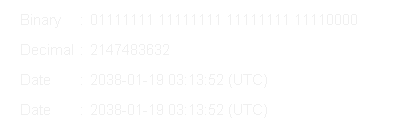

# 16.8 float のしくみ

この項では`float`型(本項で`float`型とは、後述する IEEE Standard for Floating-Point Arithmetic (ANSI/IEEE Std 754-2008) に準拠した`float`型についてを言います)のしくみと、それから考えられる性質などについて解説していきます。

## 16.8.1 コンピュータにおける「数」とはなにか
コンピュータにおける数と、数学の整数や実数は、よくよく考えると異なるものです。
コンピュータでは有限の記憶領域しかありません。よって、無数にある数を表すということは根本的に不可能です。
つまりコンピュータ上の「数」とは「本物の数になるべく似せた別の何か」と捉えることができます。
例えば、32 ビットの変数であれば ```mr 2^{32} ```mrend でおおよそ 40 億、16 ビットであれば同じようにして 65000、8 ビットであれば 256 種類表せることとなります。<br>
しばしば話題にも取り上げられる、2038 年問題とは、このようにコンピュータ上の数が有限数であることに起因します。この問題は、協定世界時における 1970 年 1 月 1 日 0 時 0 分 0 秒からの経過秒数(これを UNIX 時間といいます)を使用して時刻を表現するコンピュータ等のシステムで、その経過秒数が型の上限値を超えてしまうことで、時刻を正常に取り扱えなくなるといった問題です。UNIX 時間を利用しているシステムはこの世の中に多く存在します。この経過秒数を表現する型は、現在の標準では`time_t`型であり、C++ にも同様`<ctime>`に`std::time_t`型が定義されています。この型の実装詳細(範囲や精度)は、各実装に依存することとなっているため、厳密には定められていませんが、多くの伝統的な実装では`int`型を`time_t`としており、その`int`型は 32 ビットの型でした([2.1 変数とデータ型](../Chap2/21-変数とデータ型.md)で示している通り、C++ において`int`型は必ず 32 ビットであると定められているわけではありません)。`int`、すなわち`signed int`型の最大値は ```mr 2^{31} - 1 = 2147483647 ```mrend です。この型で取り扱える経過秒数とは、せいぜい 2,147,483,647 秒(```mr \fallingdotseq ```mrend 68 年)までに限られているのです。よって、1970年 1 月 1 日 0 時 0 分 0 秒から 2,147,483,647 秒を経過した 2038 年 1 月 19 日 3 時 14 分 7 秒を過ぎると、この値がオーバーフローしてしまい、負と扱われてしまうため、この時刻の値を前提としたプログラムが誤作動してしまう可能性があります。

|  |
| -- |
| 上から2進、10進、オーバーフローの影響を受けた時刻、正しい時刻(by [Monaneko](https://commons.wikimedia.org/wiki/User:Monaneko) - Own work, [パブリック・ドメイン](https://en.wikipedia.org/wiki/Public_domain)) |

解決策としては、`time_t`を 64 ビットの整数型とするなどが考えられています。64 ビットの整数型にした場合、上限は ```mr 2^{63} - 1 = 9223372036854775807 ```mrend であり、年数に変換するとおよそ西暦 3000 億年にもなるため、事実上問題が発生することはありません。<br>
さて、2038 年問題は整数型における上限値の問題でした。しかし、型が異なっても、例えば`std::int32_t`型と`float`型でも、メモリを直接見てみれば単に 32 個の 0 と 1 が並んだものにすぎません。そのメモリ領域の読み方、使い方が異なるだけで、おおよそ 40 億種類の数字の組み合わせでしか表現ができないことは、全く同じです。<br>
この事実から、コンピュータ上の「数」とは「本物の数になるべく似せた、つまり近似的な別の何か」、また「限られた範囲の中で、型の性質ごとに色々表現方法をやりくりしている」ということをまずは抑えておきましょう。

## 16.8.2 2 進数の復習と固定小数点
実際に IEEE 754 の説明に入る前に、少し 2 進数に関してのおさらいと固定小数点に関して触れておきます。整数において ```mr 2 ```mrend 進数は、桁が上がるにつれて ```mr 2 ```mrend の乗数を表しました。<br>

```mr \cdots \overbrace{0}^{2^{6}}\overbrace{0}^{2^{5}}\overbrace{0}^{2^{4}}\overbrace{0}^{2^{3}}\overbrace{0}^{2^{2}}\overbrace{1}^{2^{1}}\overbrace{1}^{2^{0}} ```mrend

<br>
ところで、二進数で小数を表現する事はできるのでしょうか？もちろん、できます。fractional part 部はどうなるかというと、桁が下がるにつれて ```mr 0.5 ```mrend の乗数、つまり ```mr 2 ```mrend のマイナス乗を意味します。

```mr \cdots \overbrace{0}^{2^{6}}\overbrace{0}^{2^{5}}\overbrace{0}^{2^{4}}\overbrace{0}^{2^{3}}\overbrace{0}^{2^{2}}\overbrace{1}^{2^{1}}\overbrace{1}^{2^{0}}.\overbrace{0}^{2^{-1}}\overbrace{0}^{2^{-2}}\overbrace{1}^{2^{-3}}\overbrace{0}^{2^{-4}}\overbrace{0}^{2^{-5}}\overbrace{0}^{2^{-6}}\cdots ```mrend
<br>

2 進数でfractional part 分を表すことができることがわかりました。じゃあそれならば、整数型と同じようにして、ある一定の部分から下を小数として解釈し、そうでない部分を整数として解釈するようにして、単にビット列を並べれば良いじゃないかと思うかもしれません。
それは、まさに**固定小数点**と呼ばれる形態です。固定小数点とは、整数型を構成するビット列を、Number part と fractional part に分ける(符号部も扱う場合はそれに 1 ビットを費やします)ことで実現します。
例えば、```mr 32 ```mrend ビットのデータ型でこれを表現しようとした例が次の通りです。<br>

```mr \overbrace{\underbrace{\overbrace{\underbrace{0\lor 1}_{2^{23}}\cdots\underbrace{0 \lor 1}_{2^{2}}\underbrace{0 \lor 1}_{2^{1}}\underbrace{0 \lor 1}_{2^{0}}}^{24bit}}_{Number part }.\underbrace{\overbrace{\underbrace{0 \lor 1}_{2^{-1}}\underbrace{0 \lor 1}_{2^{-2}}\underbrace{0 \lor 1}_{2^{-3}}\cdots\underbrace{0 \lor 1}_{2^{-8}}}^{8bit}}_{fractional part }}^{32bit} ```mrend

これは、fractional part を ```mr 8 ```mrend ビット、Number part を ```mr 24 ```mrend ビットとした場合の例です(固定小数点と呼ばれるものが必ずこの形式であるという決まりはありません。)。<br>
C++17 には、固定小数点を表現する型は標準では用意されていません(C++17 に標準で用意されているfractional part 分を扱える型として`float`と`double`がある事はもちろんご存知でしょう。この二つの型は本項のメインテーマである浮動小数点数を表す型であり、固定小数点と対比されることが多いです)。<br>
しかしながら、Number part とfractional part の管理を行えれば、固定小数点型を自作することはもちろん可能です。以下は符号なし固定小数点型をシミュレートした簡単なクラスです。
```cpp
#include <iostream>
#include <type_traits>
#include <climits>
#include <cstdint>
#include <cmath>

//! TPLCXX17 namespace
namespace TPLCXX17 {
////! chapter 16.8.1 namespace
namespace chap16_8_1 {
////! version 1 namespace
namespace v1 {

/**
 * @class simply_fixed_point
 * @brief 簡素化された符号なし固定小数点数型のシミュレートクラス
 * @code
 * int main()
 * {
 *     TPLCXX17::chap16_8_1::v1::simply_fixed_point fp(static_cast<std::uint16_t>(42));
 *     std::cout << fp << std::endl; // 42
 *
 *     fp = TPLCXX17::chap16_8_1::v1::simply_fixed_point::convert_fixed_point(1.23);
 *     std::cout << fp << std::endl; // 1.23047
 * }
 * @endcode
 */
class simply_fixed_point {
    // 1 バイトは 8 ビットでなければならない
    static_assert(CHAR_BIT == 8);
public:
    //! 32 ビット符号なし領域を用います
    typedef std::uint32_t value_type;
private:  
    //! fractional part のビットサイズを表します。
    inline static constexpr value_type fractional_size = 8;
    
    /**
     * @class is_integral
     * @brief コンストラクタで SFINAE を行うためのヘルパーです
     */
    template <class T>
    struct is_integral
        : std::conjunction<std::is_unsigned<T>, std::bool_constant<(sizeof(T) <= (sizeof(value_type) * CHAR_BIT - fractional_size) / CHAR_BIT)>> {};
public:
    /**
     * @brief デフォルトコンストラクタ
     */
    constexpr explicit simply_fixed_point() = default;

    /**
     * @brief Number part コンストラクタ
     * @param x is_integral に沿うデータ型 T。SFINAE で失敗しなかった場合、それが問答無用で 24 ビット以下の整数値であるとみなします。
     */
    template <class T, std::enable_if_t<is_integral<T>::value, std::nullptr_t> = nullptr>
    constexpr explicit simply_fixed_point(T x) : data_(std::move(x))
    {
        data_ <<= fractional_size;
    }

    /**
     * @brief 固定小数点型を受け付けるコンストラクタ
     * @param x is_integral に沿わないデータ型 T。SFINAE で失敗しなかった場合、それが問答無用で固定小数点型の形式にビット列が並んでいるものとみなします。
     */
     template <class T, std::enable_if_t<std::negation<is_integral<T>>::value, std::nullptr_t> = nullptr>
     constexpr explicit simply_fixed_point(T x) : data_(std::move(x)) {}

     /**
      * @brief Number part 代入演算子
      * @param x is_integral に沿うデータ型 T。SFINAE で失敗しなかった場合、それが問答無用で 24 ビット以下の整数値であるとみなします。
      */
     template <class T>
     constexpr std::enable_if_t<is_integral<T>::value, simply_fixed_point&> 
     operator=(T x)
     {
         data_ = std::move(x);
         data_ <<= fractional_size;
         return *this;
     }

     /**
      * @brief 固定小数点型を受け付けるコンストラクタ
      * @param x is_integral に沿わないデータ型 T。SFINAE で失敗しなかった場合、それが問答無用で固定小数点型の形式にビット列が並んでいるものとみなします。
      */
     template <class T>
     constexpr std::enable_if_t<std::negation<is_integral<T>>::value, simply_fixed_point&> 
     operator=(T x)
     {
         data_ = std::move(x);
         return *this;
     }

     /**
      * @brief 浮動小数点数型から固定小数点型の値に変換するヘルパ関数
      * @param x 浮動小数点数型の値
      * @return @a x を固定小数点型に変換した値
      */
     template <typename FloatingPoint>
     static constexpr std::enable_if_t<std::is_floating_point<FloatingPoint>::value, value_type> 
     convert_fixed_point(FloatingPoint x)
     {
         // 2 の fractional_size 乗かけた値
         return static_cast<value_type>(std::round(x * std::pow(2, fractional_size)));
     }
private:
     /**
      * @brief 標準出力ライブラリライクなシフト演算のオーバーロード
      * @param os std::ostream のオブジェクト
      * @param this_ simply_fixed_point のオブジェクト
      * @return @a os
      */
     friend std::ostream& operator<<(std::ostream& os, const simply_fixed_point& this_)
     {
         return os << this_.data_ / std::pow(2, fractional_size);
     }

     //! Number part とfractional part にわけた固定小数点の領域として使います
     value_type data_ = 0;
};

} // namespace v1
} // namespace chap16_8_1
} // namespace TPLCXX17
```
固定小数型型における何よりの欠点は、表現できる幅が非常に狭いということです。<br>
上述の固定小数点型における形態では、```mr 2^{-8} ```mrend までの小数点しか扱う事ができません。また、Number part は残りの ```mr 2^{24} ```mrend 種類のビットパターンしか表せません。

## 16.8.2 float の中身
固定小数点型では、表せる数値の範囲が狭いことがわかりました。ここからは、C++ にも標準で搭載されている浮動小数点数型について説明していきます。<br>
符号なし 32 ビット整数を解釈する際には、32 個の 2 進ビットをそのまま読みます。また符号つきである場合は、[16.6 補数](./166-complement.md)で説明した通り補数を用いてその値を表現しました。<br>
では、`float`は一体どのようにして値を表現しているのでしょうか。
C++ における`float`型とは、**単精度浮動小数点数型**と言われる浮動小数点型であり、前述した通りビット列によって実数を表現します。
その表現方法は、国際標準規格 **IEEE Standard for Floating-Point Arithmetic (ANSI/IEEE Std 754-2008)**(以下これを IEEE 754 と称します)として 5 種類定められており、以下に示す形式は、同国際標準規格のうちの 1 つである、**binary32** という形式です。一般的な実装では、C++ における`float`型はこの形式に則って実装されます。

```mr \overbrace{ \overbrace{\underbrace{1}_{({\bf s}ign)}}^{1bit} \overbrace{\underbrace{10000010}_{({\bf e}xponent)}}^{8bit} \overbrace{\underbrace{01001000000000000000000}_{({\bf f}raction)}}^{23bit}}^{32 bit} ```mrend

<br>
各用語は次の通り対応します。<br>
```mr -10.25 = \overbrace{-}^{sign}\overbrace{1.025}^{fraction} \times 10^{\overbrace{{1}}^{exponent}} ```mrend<br>

IEEE 754 では上図のように、32 ビットを 3 つに分割し、一番右側を 0 ビット目とし、一番左側を 31 ビット目とします。
そしてなによりも特徴的なのが、指数と仮数で数値を表現するという点です。
このような表現をする理由は、まさに固定小数点型における問題であった、表現できる数値範囲が狭い問題を解決するためです。
10 進数の実数値から、この IEEE 754 binary32 フォーマットへの変換は、大まかには次の手順で行います。

1. 実数値を ```mr -10.25 ```mrend というようにNumber part とfractional part で表現するものとする。
2. Number part を二進法で表現したものに変換する
3. fractional part を以下に示す技法で変換する
4. 2 つの変換結果を組み合わせ、さらに変換を加えて最終的な表現を得る。

なお、上図のビット列は、```mr -10.25 ```mrend を表す IEEE 754 準拠のビット列です。これをふまえて、```mr -10.25 ```mrend という数値を順番に IEEE 754 形式に変換していきながら、その形式や特徴を説明します。

### 符号部

まずは符号部についてです。これはシンプルで、正ならば ```mr 0 ```mrend が、負ならば ```mr 1 ```mrend がこの部分に入ります。現時点では次のようになります。<br>

```mr \overbrace{ \overbrace{\underbrace{1}_{({\bf s}ign)}}^{1bit} \overbrace{\underbrace{\cdots}_{({\bf e}xponent)}}^{8bit} \overbrace{\underbrace{\cdots}_{({\bf f}raction)}}^{23bit}}^{32 bit} ```mrend

### 仮数部

次に、仮数部です。上図の通り、23 ビットで ```mr 10.25 ```mrend の仮数を表現します。<br>
次の順番で仮数部を得る事ができます。

1. ```mr 10.25 ```mrend を ```mr 10 ```mrend と ```mr 0.25 ```mrend に分離する
2. それぞれ 2 進に変換し、 ```mr 10 = 1010_{(2)} ```mrend、```mr 0.25 = 0.0100_{(2)} ```mrend
3. 合わせて、```mr 1010.0100_{(2)} ```mrend
4. Number part 分に ```mr 1 ```mrend がくるように、小数点を移動する。この場合、```mr 1010.0100_{(2)} ```mrend から 小数点の位置を左に 3 つずらすとNumber part 分に 1 がくるので、```mr 1.0100100_{(2)} ```mrend(これを**正規化**といいます)
5. 必ずNumber part 分に ```mr 1 ```mrend がくるため、これを省き、あるものとして認識する。```mr 0100100_{(2)} ```mrend
6. 空いている箇所に```mr 0 ```mrend を埋める

この手順は、より形式的に要約すると次のようになります。

1. ```mr 10.25 = 1010.0100_{(2)} ```mrend を ```mr 1.0100100_{(2)} \times 2^{3} = 1.0100100_{(2)} \times 10^{11_{(2)}}_{(2)} ```mrend という仮数と指数表現の形に変換する
2. 必ずNumber part 分に ```mr 1 ```mrend がくるため、これを省き、あるものとして認識する。```mr 0100100_{(2)} ```mrend
3. 空いている箇所に ```mr 0 ```mrend を埋める

ここまでで、次のようになりました。

```mr \overbrace{ \overbrace{\underbrace{1}_{({\bf s}ign)}}^{1bit} \overbrace{\underbrace{\cdots}_{({\bf e}xponent)}}^{8bit} \overbrace{\underbrace{01001000000000000000000}_{{\bf f}raction)}}^{23bit}}^{32 bit} ```mrend
<br>
仮数部の表現は、前述した通り仮数部の直前に小数点があるという前提で行われています。
また 5 によって、仮数部で表現されるビット列の一つ上の桁に暗黙の 1 ビットがあるとみなせるため(これをいわゆるケチ表現と言ったりします)、実際の仮数部のビット数は 23 ビットですが、実質的には 24 ビット相当の精度で表現する事ができるという事です。なお 5 などでは、必ずNumber part 分に ```mr 1 ```mrend がくると述べていますが、これには一点例外があり、変換する値が ```mr 0 ```mrend であった場合が該当します。
その場合、仮数部とこの後に説明する指数部も含めて全て ```mr 0 ```mrend になります。このときの値は、```mr 0.0000\cdots ```mrend を表現します。
<br>
ところでなぜ浮動小数点数が浮動小数点数と言うのかがこれで分かったはずです。仮数部で小数点の位置が変わる事から、浮動小数点数と言われているのですね。

### 指数部
最後に指数部です。ここには、仮数部で動かした桁数を表します。よって指数部は ```mr 3 ```mrend となります。
このとき、```mr 3 = 011_{(2)} ```mrend ですから ```mr 011_{(2)} ```mrend が指数部の値となりそうです。しかし、指数部の表現は 2 の補数表現を用いない、つまり符号なしとして扱います(大小比較の単純化のためです)。<br>
では、指数部でマイナスを表現したいときはどうすれば良いのでしょうか。それは、**仮数部で動かした桁数 + ```mr 127 ```mrend をして、符号なしの範囲のみで表現できるようずらす事で表現します。**
このようにある値を一定の基準値からの間隔で表した値をオフセットまたはオフセット値、そのような形態の表現をオフセット表現と言います。また、このときの ```mr 127 ```mrend をバイアス値といったりします。<br>
```mr 011_{2} ```mrend に対してバイアス値 ```mr 127 = 01111111_{(2)} ```mrend を加えると、```mr 130 = 10000010_{(2)} ```mrend となります。この値を指数部に入れ、次のようになりました。<br>

```mr \overbrace{ \overbrace{\underbrace{1}_{({\bf s}ign)}}^{1bit}\overbrace{\underbrace{10000010}_{({\bf e}xponent)}}^{8bit} \overbrace{\underbrace{01001000000000000000000}_{{\bf f}raction)}}^{23bit}}^{32 bit} ```mrend

<br>
というわけで、```mr -10.25 ```mrend を IEEE 754 準拠の浮動小数点数に変換する事ができました。なお、指数部に関しても一点例外があり、指数部の全てのビットが 1 である場合(255である場合)は、無限大(```mr \infty ```mrend)を表現します。<br>

### まとめ
冒頭で ```mr -10.25 ```mrend という数値を ```mr \overbrace{-}^{sign}\overbrace{1.025}^{fractional} \times 10^{\overbrace{{1}}^{exponent}} ```mrend と表現したように、IEEE 754 も 2 進数上でこのように仮数と指数を組み合わせて利用することで、値を表現します。
このように、指数と仮数によって数値表現を行う事で、どのような影響がでるのかについては後述していますが、まずは利点として、**少ないビット数で広い範囲を表現できる方法である**ということを、ここまでで実感できたはずです。

最後にもう一度練習として、別の値を IEEE 754 準拠の値に変換して見ましょう。例として ```mr 25.625 ```mrend を変換して見ます。符号部は正ですから、まずは次のようになるはずです。<br>

```mr \overbrace{ \overbrace{\underbrace{0}_{({\bf s}ign)}}^{1bit} \overbrace{\underbrace{\cdots}_{({\bf e}xponent)}}^{8bit} \overbrace{\underbrace{\cdots}_{{\bf f}raction)}}^{23bit}}^{32 bit} ```mrend

<br>
次に、```mr 25.625 = 11001.101_{(2)} ```mrend を指数と仮数で表現していきます。
冒頭で述べた通り、2 進数上で数値は一桁あがるごとに ```mr 2 ```mrend 乗、下がるごとに ```mr -2 ```mrend 乗になりますから、指数もそれに応じて表現できます。
つまり、```mr 1.1001101_{(2)} \times 2^{4} = 1.1001101_{(2)} \times 2^{100_{(2)}}_{(2)} ```mrend ということです。
仮数部に実際に入る値は、先頭の 1 ビットを取り除きますから、現時点で次のようになります。

```mr \overbrace{ \overbrace{\underbrace{0}_{({\bf s}ign)}}^{1bit} \overbrace{\underbrace{\cdots}_{({\bf e}xponent)}}^{8bit} \overbrace{\underbrace{10011010000000000000000}_{{\bf f}raction)}}^{23bit}}^{32 bit} ```mrend
<br>
指数部には先ほどの指数 ```mr 4 ```mrend を表現します。バイアス値である ```mr 127 ```mrend を加えて ```mr 131 = 100000011_{(2)} ```mrend です。よって<br>
```mr \overbrace{ \overbrace{\underbrace{0}_{({\bf s}ign)}}^{1bit} \overbrace{\underbrace{10000011}_{({\bf e}xponent)}}^{8bit} \overbrace{\underbrace{10011010000000000000000}_{{\bf f}raction)}}^{23bit}}^{32 bit} ```mrend
<br>
となります。<br>
因みに C++ には`std::bitset`が用意されています。これを次のように利用して、浮動小数点数のビット列を確認できます。
```cpp
#ifndef DOXYGEN_SHOULD_SKIP_THIS
#include <iostream>
#include <bitset>
#include <cstring>
#include <climits>
#include <limits>

int main()
{
    typedef float floating_point;
    static_assert(std::numeric_limits<floating_point>::is_iec559);
    
    floating_point a = 25.625f;
    std::uint32_t dst;
    std::memcpy(&dst, &a, sizeof dst);
    std::cout << std::bitset<sizeof(std::uint32_t) * CHAR_BIT>(dst) << std::endl;
}
#endif
```
なお、少し浮動小数点数の話題からはそれてしまいますが、次のようにキャストして利用してはなりません。
```cpp
#ifndef DOXYGEN_SHOULD_SKIP_THIS

float a = 25.625f;
std::cout << std::bitset<sizeof(float) * CHAR_BIT>(*reinterpret_cast<unsigned long*>(&a)) << std::endl; // strict aliasing ルール違反

#endif
```
これは`std::bitset`に限られた話ではなく、C++ の strict aliasing ルールに違反するコードであるため、未定義の動作を引き起こします。
strict aliasing ルールに関しましては、 [16.1 strict alias rule](161-strict_alias_rule.md) にて説明しています。

## 16.8.3 数値範囲
指数部が全て ```mr 1 ```mrend であるときに、無限を表現すると前述しました。また、全てのビットが 0 だと```mr 0.0000\cdots ```mrend を表現するとも述べました。
では、それらを除いた実際の数値として扱える範囲を、実際に確認してみましょう。
まずは正の数における最小値です。<br>

```mr \overbrace{ \overbrace{\underbrace{0}_{({\bf s}ign)}}^{1bit} \overbrace{\underbrace{00000001}_{({\bf e}xponent)}}^{8bit} \overbrace{\underbrace{00000000000000000000000}_{{\bf f}raction)}}^{23bit}}^{32 bit} ```mrend

まずはこの指数部に着目します。指数部は ```mr 1 ```mrend となっていますが、これはここまで説明してきた通り、バイアス値である ```mr 127 ```mrend を加えると ```mr 1 ```mrend になる値を意味します。
よって、```mr -126 ```mrend です。
また仮数部は、仮数部の説明で述べた通りケチ表現がされているため、つまり、```mr 1.\underbrace{\overbrace{00000000000000000000000}^{23bit}}_{{\bf f}raction)} ```mrend という表現であるため、値は ```mr 1 ```mrend です。
よってその値は、```mr 1.0 \times 2^{-126} \fallingdotseq 1.17549 \times 10^{-38} ```mrend です。<br>
次に、最大値を考えて見ましょう。<br>

```mr \overbrace{ \overbrace{\underbrace{0}_{({\bf s}ign)}}^{1bit} \overbrace{\underbrace{11111110}_{({\bf e}xponent)}}^{8bit} \overbrace{\underbrace{11111111111111111111111}_{{\bf f}raction)}}^{23bit}}^{32bit} ```mrend

<br>
同じく指数部に着目します。指数部は、バイアス値を加えて ```mr 11111110_{(2)} = 254 ```mrend となる値ですから、```mr 127 ```mrend です。また仮数部は先ほどと同様にして ```mr 1.\underbrace{\overbrace{11111111111111111111111}^{23bit}}_{{\bf f}raction)} ```mrendという意味になりますから、これはおおよそ ```mr 2 ```mrend です。よってその値は ```mr 2.0 \times 2^{127} \fallingdotseq 3.40282 \times 10^{38} ```mrend となります。<br>

非常に広い範囲の数値を表現できることがわかりました。

## 16.8.4 精度と誤差
IEEE 754 binary32 の表現方法は、非常に広い範囲の数値を表現できることがわかりましたが、この表現方法には欠点もあります。
それは、誤差が生まれるということです。
例えば ```mr 0.1 ```mrend といった数値の場合、これを 2 進で考えると、```mr 0.000110011001100\cdots ```mrend と循環してしまいます。
有限桁しか扱えないコンピュータ内部では、どこかで打ち切るしかありません。この打ち切りによって、真の値との誤差が生まれてしまいます。<br>

これだけならばまだ良いのですが、更に付け加える必要があります。
例として、```mr 1.000\cdots ```mrend と ```mr 2.000\cdots ```mrend を IEEE 754 binary32 の形にすると次のようになります。

```mr 1.00\cdots=\overbrace{ \overbrace{\underbrace{0}_{({\bf s}ign)}}^{1bit} \overbrace{\underbrace{01111111}_{({\bf e}xponent)}}^{8bit} \overbrace{\underbrace{00000000000000000000000}_{{\bf f}raction)}}^{23bit}}^{32bit} ```mrend <br>
```mr 2.00\cdots=\overbrace{ \overbrace{\underbrace{0}_{({\bf s}ign)}}^{1bit} \overbrace{\underbrace{10000000}_{({\bf e}xponent)}}^{8bit} \overbrace{\underbrace{00000000000000000000000}_{{\bf f}raction)}}^{23bit}}^{32bit} ```mrend <br>
この場合、二つの数値の中間値は仮数部の分、すなわち 23 ビットのパターンで表すことができます。```mr 2^{23} \fallingdotseq ```mrend 830 万ですからこの間では非常に精密に表現できる事が分かりますね。<br>
次に、```mr 4.000\cdots ```mrend も並べて見ましょう。<br>
```mr 4.00\cdots=\overbrace{ \overbrace{\underbrace{0}_{({\bf s}ign)}}^{1bit} \overbrace{\underbrace{10000001}_{({\bf e}xponent)}}^{8bit} \overbrace{\underbrace{00000000000000000000000}_{{\bf f}raction)}}^{23bit}}^{32bit} ```mrend<br>
```mr 2.00 \cdots ```mrend と ```mr 4.00 \cdots ```mrend の中間値は、どれだけのパターンで表現することができますでしょうか。さきほどと同じく、これまた 23 ビットのパターンで表します。<br>
続いて、```mr 8.000\cdots ```mrend も見て見ましょう。<br>
$$ 8.00\cdots=\overbrace{
\overbrace{\underbrace{0}_{({\bf s}ign)}}^{1bit}
\overbrace{\underbrace{10000010}_{({\bf e}xponent)}}^{8bit}
\overbrace{\underbrace{00000000000000000000000}_{({\bf f}raction)}}^{23bit}}^{32bit} $$<br>
```mr 4.00 \cdots ```mrend と ```mr 8.00 \cdots ```mrend の中間値は、どれだけのパターンで表現することができますでしょうか。同じく、23 ビットのパターンで表します。<br>

最後に、```mr 2\times 10^{9} = 20 ```mrend 億と ```mr 4\times 10^{9} = 40 ```mrend 億を同じ形式にして見て見ます。

```mr 2 \times 10^{9} = \overbrace{ \overbrace{\underbrace{0}_{({\bf s}ign)}}^{1bit} \overbrace{\underbrace{10011101}_{({\bf e}xponent)}}^{8bit} \overbrace{\underbrace{11011100110101100101000}_{{\bf f}raction)}}^{23bit}}^{32bit} ```mrend

```mr 4 \times 10^{9} = \overbrace{ \overbrace{\underbrace{0}_{({\bf s}ign)}}^{1bit} \overbrace{\underbrace{10011110}_{({\bf e}xponent)}}^{8bit} \overbrace{\underbrace{11011100110101100101000}_{{\bf f}raction)}}^{23bit}}^{32bit} ```mrend

```mr 20 ```mrend 億と ```mr 40 ```mrend 億は同じようにして、23 ビットのパターンで表現されます。<br>
さて、これらは、**数が大きくなればなるほど、仮数部における 23 ビットのパターンが引き伸ばされることから、結果として数値間の精度が落ちていく**ということを示しています。
```mr 1.00 \cdots ```mrend と ```mr 2.00\cdots ```mrend の間では 830 万通りの表現ができますから、それなりに精密な小数点を扱えることが分かります。
しかし、```mr 20 ```mrend 億もの数値になると、そこから ```mr 40 ```mrend 億までの間を 830 万 通りのみで表現する事となるのですから、これは明らかにいくらかの極端な誤差が生じることが予想できます。
binary32 の表現方法の必然として、大きな値を扱うためには指数部の値を大きくしていく必要があります。
指数が 1 つあがれば値は爆発的に増加します。これまで述べてきた通り、仮数部は、その指数値間の値を表現しなければなりません。
これらの事から、値を上げていくと、やがて 23 ビットのみでは(つまり 830 万通りでは)その指数値間の値を表現できるどこかで近似的に保持していくこととなり、最終的には整数単位ですら表現できなくなることがわかります。<br>

次のグラフは、```mr 1.00 \cdots ```mrend から ```mr 2.00 \cdots ```mrend の間の精度を元に点でプロットしたものです。```mr 2.00 - 1.00 ```mrend より二つの値の差異は ```mr 1.00 \cdots ```mrend です。これを ```mr 2^{23} ```mrend で分割して表現しますから ```mr 1.00 \div 2^{23} = 1.19209e-07 ```mrend の精度でこの間を表現できることになります(IEEE 754 binary32 実装の`float`型の環境において、`std::numeric_limits<float>::epsilon()`(`epsilon`という名前の定義は、後述しています)とすることで、同様の値を取得できます)。この値を**誤差幅**(また後に説明するAbsolute error )といいます。ここから考えられるように、またグラフからもわかるように、これは点でのプロットを行なったグラフですが、点があまりにも高密度であるためほぼ線のように見えています。


次の図は、```mr 2.00 \cdots ```mrend から ```mr 4.00 \cdots ```mrend の間の精度を元にプロットした図です。
両者の差は ```mr 4.00 - 2.00 = 2.00 ```mrend でこれを ```mr 2^{23} ```mrend で分割しますから ```mr 2.00 \div 2^{23} = 2.38419e-07 ```mrendとなります。誤差幅が増えていることが分かりますね。
グラフにして見てみるとまだ視覚的には特別差異がないようです。


これは、```mr 2.00 \cdots ```mrend から ```mr 4.00 \cdots ```mrend 間の誤差幅と同じ誤差幅で、```mr 2.5 ```mrend までをプロットしたグラフです。
このように拡大してみても、現時点ではまだ密度が高いと言えます。


このまま 1 ずつ指数を進めていても、誤差幅はその指数に比例して広がっていくためグラフの変化はあまりないので、一気に ```mr 2^{21} ```mrend と ```mr 2^{20} ```mrend 間に飛ぶこととします。
二つの差異は ```mr 2^{21} - 2^{20} = 2^{20} = 1048576 ```mrend です。これを ```mr 2^{23} ```mrend で分割しますから ```mr 1048576 \div 2^{23} = 0.125 ```mrend となります。誤差幅が一気に増えましたね。<br>
ここでは比較を用意にするために、```mr 2^{20} ```mrend から ```mr 2^{21} ```mrend 間の精度を単にプロットするのではなく、```mr 2^{20} ```mrend から ```mr 2^{20} + 2 ```mrend 間の精度をプロットします。<br>
また、誤差幅さえあっていれば、何も ```mr 2^{20} ```mrend から ```mr 2^{20} + 2 ```mrend を愚直にプロットする必要はなく、```mr 0 ```mrend から ```mr 2 ```mrend を誤差幅 ```mr 0.125 ```mrend でプロットします。
寧ろ、これまで述べてきたように、大きな値を用いた演算は誤差幅が大きくなりますから、正しくプロットするためにはできる限り小さい値を用いて行った方が良いことは想像に容易いでしょう。


ついに誤差がグラフ上でも確認できるようになってしまいました。
値は当然ながら、このグラフ上の点のどこかでしか表現する事ができないので、点と点の間の数値がもし発生したとしても、このどれかの点上に強制的に合わされます。
このような、切り捨て、切り上げによって有効桁数未満の桁を削除することによって発生する誤差を、**丸め誤差(Round-off error)**といいます。丸め誤差のイメージは、次の図の通りです。


ところで、いずれ整数単位ですら表現できなくなると前述しましたが、その境界はどこからでしょうか。それは、誤差幅が ```mr 1 ```mrend よりも大きくなったときです。
誤差幅がちょうど ```mr 1 ```mrend となるのは、差が ```mr 2^{23} ```mrend となるときですね(```mr 2^{23} \div 2^{23} = 1 ```mrend)。
それは当然、```mr 2^{23} = 8388608 ```mrend から ```mr 2^{24} = 16777216 ```mrend の間となるので、```mr 2^{24} ```mrend よりも大きくなった途端に整数単位での表現も正常に行えなくなるということになります。
これを試して見ましょう。
```cpp
#ifndef DOXYGEN_SHOULD_SKIP_THIS
#include <iostream>
#include <bitset>
#include <limits>
#include <cstring>
#include <climits>
#include <cmath>

struct print_bit {
    constexpr explicit print_bit(float f) : data_(std::move(f)) {}
private:
    float data_;

    friend std::ostream& operator<<(std::ostream& os, const print_bit& this_)
    {
        static_assert(std::numeric_limits<float>::is_iec559);
        std::uint32_t ui;
        std::memcpy(&ui, &this_.data_, sizeof ui);
        return os << std::bitset<sizeof ui * CHAR_BIT>(ui);
    }
};

std::string round_style()
{
    if constexpr (constexpr std::float_round_style fs = std::numeric_limits<float>::round_style; fs == std::round_toward_zero) {
        return "toward zero";
    } else if constexpr (fs == std::round_to_nearest) {
        return "to nearest";
    } else if constexpr (fs == std::round_toward_infinity) {
        return "toward infinity";
    } else if constexpr (fs == std::round_toward_neg_infinity) {
        return "toward negative infinity";
    } else {
        return "indeterminate";
    }
}

int main()
{
    // 丸め方式を出力
    std::cout << round_style() << std::endl; // 筆者の環境では to nearest

    const float f1 = std::pow(2, 23); // 2 の 23 乗
    // 1 は正常に足される
    std::cout << print_bit(f1 + 1.f) << std::endl;  // 01001010100000000000000000000001
    // 丸め方式によって実際の値は変わり得るものの正常には足されない
    std::cout << print_bit(f1 + 0.5f) << std::endl; // 01001011000000000000000000000000

    const float f2 = std::pow(2, 24); // 2 の 24 乗
    // 単に出力
    std::cout << print_bit(f2) << std::endl; // 01001011100000000000000000000000
    // 丸め方式によって実際の値は変わり得るものの正常には足されない
    std::cout << print_bit(f2 + 1) << std::endl; // 01001011100000000000000000000000
}
#endif
```
このコードとコメントにある実行結果では、`f1 + 0.5f`と`f2 + 1`の演算でそれぞれ`+ 0.5f`と`+ 1`が完全に無視された結果となっていますね。このような現象を**情報落ち**といいます。
```mr 2^{23} ```mrend は誤差幅が ```mr 1 ```mrend であるため、```mr 0.5 ```mrend を足そうとすると、後に説明する丸め処理によって、```mr 1 ```mrend 単位で表せる前後どちらかに丸められてしまいます。
その結果、`+0.5`は無視されてしまいました。
また、```mr 2^{24} ```mrend になった途端、誤差幅が ```mr 2 ```mrend であるため、```mr 1 ```mrend を足そうとすると、同じようにして丸め処理によって ```mr 2 ```mrend 単位で表せる前後どちらかに丸められてしまいます。
その結果、`+1`は無視されてしまいました。<br>
浮動小数点数を用いた得られる最終的な数値は、丸め方法の違いによって異なります。つまり、たまたま正常な数値が得られる事もあります(しかしそのような演算の信頼性はあまりありません)。<br>
一旦、ここではその丸め方法について触れておきます。上記コードでは、`round_style`関数によってその丸め方法を取得しています。
IEEE 754 による最も推奨された丸め方法は、**最近接偶数丸め**という丸め方式です。これは、端数が ```mr 5 ```mrend 未満である場合は切り捨て、端数が ```mr 5 ```mrend 未満より大きければ切り上げ、端数がちょうど ```mr 5 ```mrend である場合は切り捨てと切り上げのうち結果が偶数となる方へ丸めるという方式です。四捨五入との違いは、端数がちょうど ```mr 5 ```mrend である場合の丸め方が異なります。例えば ```mr 0.5 ```mrend を丸める場合、四捨五入した結果は ```mr 1 ```mrend です。しかし最近接偶数丸めの場合は ```mr 0 ```mrend になります。いくつかその違いを表にすると分かりやすいでしょう。

| Theoretical value | 四捨五入 | 最近接偶数丸め |
| -- | -- | -- |
| 0.5 | 1 | 0 |
| 1.5 | 2 | 2 |
| 2.5 | 3 | 2 |
| 3.5 | 4 | 4 |
| 4.5 | 5 | 4 |
| 5.5 | 6 | 6 |
| 6.5 | 7 | 6 |

一般的にこの丸め方法は、四捨五入といったどの丸め方法よりも優れているとされています。
その理由は、丸めた結果の総和を比較すると分かります。

| Theoretical valueの合計 | 四捨五入の合計 | 最近接偶数丸めの合計 |
| -- | -- | -- |
| 24.5 | 28 | 24 |

Theoretical valueの合計に、最近接偶数丸め方式の値の合計の方が近い事が分かります。四捨五入の問題は、```mr 0.5 ```mrend という中間値を切り上げる方向に丸めることにあります。本来 ```mr 0.5 ```mrend は切り上げる方向でも切り下げる方向でもないどっちつかずの値のはずです。これを切り上げてしまうがために、それを繰り返した値の総和は、その誤差が蓄積していきTheoretical valueの合計から離れてしまうのです。<br>
しかし最近接丸め方式は、```mr 0.5 ```mrend という中間値を問答無用で切り上げるのではなく、Number part が偶数のものと奇数のものでそれぞれ切り捨てと切り上げを行うようにしているため、この誤差を相殺しあえるのです。
因みに、C++11 以降では`<cmath>`ヘッダーに`std::nearbyint()`関数が標準搭載されており、この丸め方式を利用することができます。四捨五入は、同ヘッダー`std::round()`で行うことができます。
<br>では、これを実際の浮動小数点数に対して適用し、浮動小数点数として現れる数値を推測してみましょう。例えば、```mr 3 \times 10^{6} + 0.125 ```mrend という数値は大きい方に丸められ ```mr 3 \times 10^{6} + 0.124 ```mrend という数値は小さい方に丸められると考えることができます。
```mr 3 \times 10^{6} ```mrend は ```mr 2^{21} ```mrend と ```mr 2^{22} ```mrend の間にあります。この間、つまり ```mr 2^{22} - 2^{21} = 2097512 ```mrend を仮数で表現しますから約 ```mr 2097512 \div 2^{23} = 0.25 ```mrend の誤差幅で表現することになります。ということは、その ```mr 0.25 ```mrend の間隔で表現できない値はどうにかして丸められるということです。よって例えばその半分である ```mr 0.25 \div 2 = 0.125 ```mrend をこの範囲内で適用しようとすると、最近接偶数丸によって大きい方へ、```mr 0.124 ```mrend であれば小さい方へ丸められます。<br>

なお、この最近接偶数丸め方式以外にもいくつか丸め方式があり、上記コードにも出てきていますが、`<limits>`ヘッダーにて次の通り`std::float_round_style`という列挙型にて判別できるよう定義されています。

| 列挙値 | 説明 |
| -- | -- |
| `round_toward_zero` | 0 に向かって丸めます |
| `round_to_nearest` | 最近接偶数で丸めます |
| `round_toward_infinity` | 正の無限表記に向かって丸めます |
| `round_toward_neg_intinity` | 負の無限表記に向かって丸めます |
| `ronud_indeterminate` | 丸めスタイルが確定しません |

`round_to_ward_infinity`は、`<cmath>`ヘッダに定義される`std::ceil`、また`round_toward_neg_intinity`は、同ヘッダに定義される`std::floor`関数と、動作が対応しています。

## 16.8.5 閉性
整数同士の演算において、加算、積算、また減算(乗法)は、どのような数値同士でも必ず結果は整数です。しかしながら整数同士の除算は、整数の組み合わせによっては結果を整数で表せません。
これを、数学において「整数全体の成す集合は、乗法について閉じているが除法について閉じていない」といいます。このような、ある集合の元に対して演算を施した結果が再びもとの集合に属することを「閉じている」、また「閉性(closure property) をもつ」と言います。<br>
実数における閉性は、どのように考えられるでしょうか。実数とは複素数でない数、つまり「普通の数」のことをいいますから、実数に対する四則演算は全て閉じている事が言えます。<br>
では、浮動小数点数における閉性は、どのように考えられるでしょうか。
浮動小数点数は、四則演算のいずれに対しても閉じていないと考えられます。なぜならば、これまでも述べてきた通り浮動小数点数は"よく似た数"、すなわち"実数を模した別の数"で強制的に置き換えるものであり、閉性の定義における、演算結果が再び元の集合に属する、ということを満たさないからです。

## 16.8.6 誤差とスケール
これまで実数を近似的に表現する幅を、つまり実際のTheoretical valueとの違いを、誤差幅というように述べてきました。<br>
ここで、誤差とは何なのかについて改めて少し触れておきます。
例えば次の 2 つの事例を見て見ましょう。

1. ```mr 1 ```mrend kg の物体の重さを測定したら、```mr 2 ```mrend kg であった。
2. ```mr 1000 ```mrend kg の物体の重さを測定したら、```mr 1001 ```mrend kg であった。

なお、上記 2 つの事例は理想的な状況における誤差であるとします。そのような状況下における誤差を**偶然誤差**といいます。
また、「```mr 1 ```mrend kg の物体の重さを測定したら、」の「```mr 1 ```mrend kg」といったような本当の実際の値のことをここではTheoretical value、またTrue value、「```mr 2 ```mrend kg であった。」といったような測定などによって得られた結果の値をここではMeasured valueと呼びます。
<br>さて、このとき誤差幅は 1 と 2 両方とも ```mr 1 ```mrend kg です。しかし、2 よりも 1 の方が大きい誤差であるように思えます。
```mr 1 ```mrend kg の物体の重さを ```mr 1 ```mrend kg も計り間違えることは重大な誤差です。
しかし、```mr 1024 ```mrend kg の物体の重さを ```mr 1 ```mrend kg 計り間違えることは、前述した事例よりも重大ではないように思えます。
このように、誤差をスケール(数字の大きさ、桁数）に関係なく、Theoretical valueからの幅だけで表すことを、主に**Absolute error (absolute error)**と言います。
反して、スケールを考慮して比率で表された誤差を**Relative error (relative error)**と言います。Absolute error とRelative error には次のような関係があります。<br>

```mr Relative error  = \dfrac{Measured value - Theoretical value(True value)}{Theoretical value(True value)} ```mrend<br>
式中の ```mr Measured value - Theoretical value(True value) ```mrend は要するにAbsolute error となります。<br>
この関係を利用して 1, 2 の事例をそれぞれRelative error で表すと、
1 は ```mr 1 ```mrend(```mr 100% ```mrend) の誤差、2 は ```mr 0.001 ```mrend(```mr 0.001 % ```mrend)の誤差であると言え、両者の誤差の比率を伺うことができます。<br><br>
これらの概念を浮動小数点数と交えると、浮動小数点数の説明はより明確になります。浮動小数点数は、上のプロット図や説明からもわかるように、離散的に値が存在すると言え、表現可能な数値の間には隙間でできることがわかりました。<br>
これに対してこの隙間は、「指数部が大きくなるにつれて絶対的な距離は大きくなるが、相対的な距離はほぼ等しい特徴がある」と説明できます。
この間隔を、**マシンイプシロン (machine epsilon)**と言います。この値は、前述した通り`std::numeric_limits<float>::epsilon()`によって取得することができ、これは`FLT_EPSILON`という定義済みマクロに対応しています。

## 16.8.7 傾向と対策
浮動小数点数では、どのような演算を行っても必ず誤差がでるということが分かりました。また、これまでの説明から誤差幅の大きさは値が大きくなるほど大きくなっていくということが分かりました。
さらに、誤差にはスケールの違いがあり、Absolute error とRelative error というそれぞれの考え方で、それが何を示しているのかを明確に伝えることができるということが分かりました。

ここでは、今まで説明してきた浮動小数点数の特性から、各演算における誤差をどの程度見積る必要があるのかについて説明します。
これを知ることは、可能な限り誤差を抑えたコードを書くために有益であるはずです。<br>

### 加算
```mr 1 + 1 ```mrend について考えます。
このとき、各 ```mr 1 ```mrend が ```mr \pm{e} ```mrend のAbsolute error を持っている場合、演算結果から取得できる ```mr 2 ```mrend は ```mr \pm{2e} ```mrend の最大Absolute error を持っていることになります。<br>
つまり、加算の結果のもつAbsolute error は、元の値のAbsolute error の和となることが言えます。
例えば、各 ```mr 1 ```mrend のRelative error が ```mr 0.1 ```mrend であるとき、各 ```mr 1 ```mrend は ```mr 0.9 ```mrend または ```mr 1.1 ```mrend の値となります(上記Relative error の公式にあてはめるとこの通りになります)。
よって結果は ```mr 1.8 ```mrend、```mr 2 ```mrend、```mr 2.2 ```mrend のうちのどれかとなるでしょう。
これは、同じRelative error をもつ数値同士の加算の結果におけるRelative error は同じになるということがいえます。
何故なのかは少し考えてみればすぐわかるはずです。同じスケール上の誤差値があるとき、その数値同士を足して結果として数値そのものが増えたとしても、誤差における比率は一定であるからです。
さらに異なるRelative error 、つまり異なるスケールを互いにもつ数値同士の加算においては、これを適用できないこともわかるはずです。<br>
明確にするため、これをより数学的に説明します。<br>
量 ```mr A, B, C, \cdots ```mrend の実験値として ```mr a, b, c \cdots ```mrend 各実験値のAbsolute error  ```mr \delta a, \delta b, \delta c, \cdots (\gt 0) ```mrend(数学、物理学において ```mr \delta ```mrend は差を表すときに用いられることがあります)があるとき、これらの量から誤差付きの量 ```mr Z = z \pm{\delta z} ```mrend を算出し、各誤差 ```mr \delta a, \delta b, \delta c \cdots (\gt 0) ```mrend が ```mr Z ```mrend(```mr \delta z ```mrend)に影響を与えるとき、誤差が**伝播する**といいます。
前述したとおりAbsolute error は、```mr Z = A + B + C + \cdots ```mrend という加法によって、```mr z ```mrend のAbsolute error  ```mr \delta z ```mrend に対し次のように伝播します。<br>
```mr \delta z \geq \delta a + \delta b + \delta c + \cdots ```mrend<br>
このとき、量 ```mr Z ```mrend を大きく見積もった場合、すなわち ```mr A + B + C + \cdots ```mrend を大きく見積もった場合、
```mr (a + \delta a) + (b + \delta b) + (c + \delta c) + \cdots = (a + b + c + \cdots) + (\delta a + \delta b + \delta c + \cdots) ```mrend と表せ、量 ```mr Z ```mrend を最も大きく見積もった場合の値を ```mr z + \delta z_{max} ```mrend としたとき、```mr \delta z_{max} = \delta a + \delta b + \delta c + \cdots ```mrend と見積もることができます。
また、量 ```mr Z ```mrend を小さく見積もった場合、すなわち ```mr A + B + C + \cdots ```mrend を小さく見積もった場合、
```mr (a - \delta a) + (b - \delta b) + (c - \delta c) + \cdots = (a + b + c + \cdots) - (\delta a + \delta b + \delta c + \cdots) ```mrend と表せ、量 ```mr Z ```mrend を最も小さく見積もった場合の値を ```mr z - \delta z_{min} ```mrend としたとき、```mr \delta z_{min} = \delta a + \delta b + \delta c + \cdots ```mrend と見積もることができます。

### 減算
```mr 2 - 1 ```mrend について考えます。
このとき、```mr 1 ```mrend が ```mr \pm{e} ```mrend のAbsolute error を持っている場合、```mr 2 ```mrend は ```mr 2e ```mrend のAbsolute error をもっていると分かります。
減算の場合も、このAbsolute error は加わります。すなわち、```mr 2 - 1 ```mrend の結果である ```mr 1 ```mrend は ```mr \pm{3e} ```mrend のAbsolute error を持っています。<br>
例えば、Absolute error  ```mr e ```mrend が ```mr \pm{0.001} ```mrend であるとき、この演算における最大誤差が発生するパターンは ```mr 2 ```mrend が ```mr 2.002 ```mrend、```mr 1 ```mrend が ```mr 0.999 ```mrend であった場合と、```mr 2 ```mrend が ```mr 1.998 ```mrend、```mr 1 ```mrend が ```mr 1.001 ```mrend であった場合でしょう。結果としてそれぞれ ```mr 1.003 ```mrend、```mr 0.997 ```mrend となり、Absolute error は ```mr 2e + 1e = 3e ```mrend というように加わっていることが分かります。<br>
加算の場合と同じく数学的に説明します。話を単純化するため、量 ```mr Z ```mrend を ```mr A - B ```mrend とします。
量 ```mr Z ```mrend を大きく見積もった場合、```mr Z = z + \delta z_{max}, A = (a + \delta a), B = (b - \delta b) ```mrend としたとき、```mr \delta z_{max} = \delta a + \delta b ```mrend と見積もることができます。
小さく見積もった場合、```mr Z = z + \delta z_{min}, A = (a - \delta a), B = (a + \delta) ```mrend としたとき、```mr \delta z_{min} = \delta a + \delta b ```mrend と見積もることができます。<br>

浮動小数点数の演算において、減算は最も誤差を含んでしまう演算です。これを体感するために、```mr 10000 - 9999 ```mrend について考えてみます。このときのAbsolute error は ```mr 10000e + 9999e = 19999e ```mrend です。
Relative error が ```mr 0.001 ```mrendであるとき、小さく、また大きく見積もるとき、公式にあてはめると ```mr 19999 \times 0.001 = 19.999 ```mrend のAbsolute error があることがわかり、それぞれ ```mr 1 - 19.999 = -18.999 ```mrend、```mr 1 + 19.999 = 20.999 ```mrend であることがわかります。このような誤差範囲の広さがある演算結果は、到底あてにできるものではありません。<br>
このようなほぼ等しい数値は、上位桁が等しく、下位桁だけ異なるという状態になっているはずです。そこで減算を行うと、上位桁は相殺され ```mr 0 ```mrend になります。そして、わずかな下位桁だけの差が結果として現れる事になります。このとき、正規化によって、現れた下位桁の後ろ側に ```mr 0 ```mrend を詰められることになります。この詰められた値 ```mr 0 ```mrend は計算によって導かれた値ではありませんが、**それが正常に計算された結果として ```mr 0 ```mrend なのか、桁落ちによって作られた ```mr 0 ```mrend なのかは、計算結果だけを見ても区別することはできません**。このようにして、本来保持していた有意な数値の桁数が減ってしまうことを**桁落ち**と言います。<br>

```mr \left( 10000 = \overbrace{ \overbrace{\underbrace{0}_{({\bf s}ign)}}^{1bit} \overbrace{\underbrace{10001100}_{({\bf e}xponent)}}^{8bit} \overbrace{\underbrace{00111000100000000000000}_{({\bf f}raction)}}^{23bit}}^{32bit} \right)- \left(9999 = \overbrace{ \overbrace{\underbrace{0}_{({\bf s}ign)}}^{1bit} \overbrace{\underbrace{01000110}_{({\bf e}xponent)}}^{8bit} \overbrace{\underbrace{000111000011110000000000}_{({\bf f}raction)}}^{23bit}}^{32bit}\right) = \left(1 = \overbrace{ \overbrace{\underbrace{0}_{({\bf s}ign)}}^{1bit} \overbrace{\underbrace{01111111}_{({\bf e}xponent)}}^{8bit} \overbrace{\underbrace{00000000000000000000000}_{({\bf f}raction)}}^{23bit}}^{32bit}\right) ```mrend <br>
ご覧の通り、有効桁数が ```mr 0 ```mrend になってしまいました。この計算結果だけを見たとき、それが桁落ちとして詰められた値なのかそうでないのか区別できないことが重大な問題です。
つまり、有効桁数の減少は、計算精度(信頼性)の悪化そのものです。そして一度減った有効桁数はもう回復することはできません。<br>
これを防ぐためには、減算そのものを行わないことが一番ですが、そのようなわけにもいかないケースでは、ほぼ等しい数値間の減算を避けるようなプログラムを書くことで回避するしかないのです。<br>
なお、「減算」というくくりで桁落ちについて説明しましたが、これは、「マイナス符号のついた加算」でも当然ながら起こることです。
よって浮動小数点数型の変数の中身がまるで何かわからない場合における加算も、同じようなリスクがあるということを留意しておきましょう。

